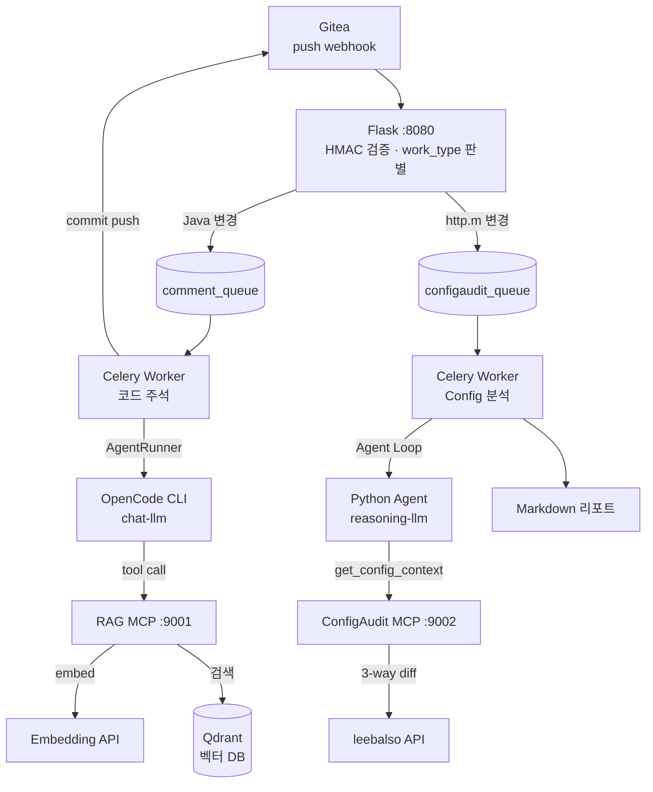
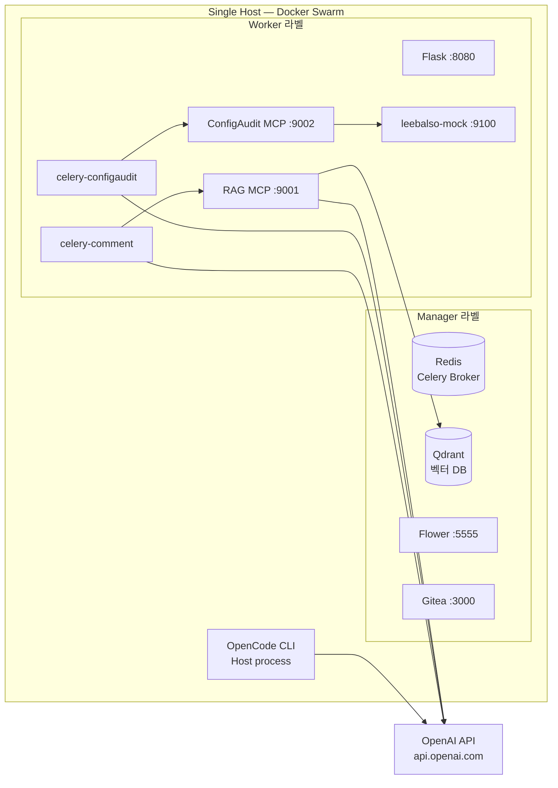

# llm-automation

LLM 기반 워크플로우 자동화 시스템 — Gitea push/PR 이벤트로 **코드 주석 자동 삽입**과 **Config 변경 분석 리포트**를 생성한다.

## 왜 이 시스템을 만드는가

사내 Gitea 에 코드가 push 되면 사람이 직접 리뷰하고 주석을 달고, 운영 config(http.m) 변경 때마다 dev/stage/prod 3개 환경을 수작업으로 비교하고 있다. 이 반복 작업을 LLM + RAG + MCP 파이프라인으로 자동화한다.

## 두 가지 워크플로우

### Workflow A — 코드 주석 자동화

```
Gitea push → Flask (HMAC 검증) → Celery comment_queue
  → AI Agent CLI (OpenCode) → LLM (chat-llm) + RAG MCP (벡터 검색)
  → 주석 삽입 → commit push [skip ci]
```

Java 코드 변경이 감지되면 AI Agent 가 RAG 로 유사 코드/주석을 검색하고, LLM 이 맥락에 맞는 주석을 삽입하여 자동 커밋한다.

### Workflow B — Config 변경 분석

```
Gitea push (http.m) → Flask → Celery configaudit_queue
  → Python Agent Loop → ConfigAudit MCP (리발소 API → 3-way diff)
  → LLM (reasoning-llm) 분석 → Markdown 리포트
```

http.m 설정 파일 변경이 감지되면 dev/stage/prod 3개 환경의 config 를 조회하여 3-way diff 를 생성하고, LLM 이 이상 패턴을 분석하여 리포트를 출력한다.

## Production ↔ Test 듀얼 스테이지 전략

이 레포는 **production 아키텍처를 단일 서버에서 최대한 충실하게 재현하는 테스트 환경**을 구축하는 것을 목표로 한다.

| | Production | Test |
|---|---|---|
| **노드** | 6대 (GPU 서버 pl99 + Manager ar41~43 + Worker ar51~52) | 1대 (single-node Swarm, Manager+Worker 겸용) |
| **오케스트레이션** | Docker Swarm | Docker Swarm (**manifest 동일**) |
| **chat-llm** | vLLM Qwen3-Coder 30B (자체 호스팅) | OpenAI gpt-4o |
| **reasoning-llm** | vLLM GPT-OSS 130B (자체 호스팅) | OpenAI o4-mini |
| **embedding** | bge-m3 ONNX (자체 호스팅) | OpenAI text-embedding-3-small |
| **리발소 API** | 실제 REST API (ar51) | leebalso-mock (결정성 보장 fixture) |
| **Git 원격** | 사내 Gitea | 로컬 Gitea 컨테이너 |

**핵심 원칙: alias 인터페이스로 prod/test 차이를 값으로만 흡수한다.**

코드와 manifest 는 `chat-llm`, `reasoning-llm`, `embedding` 이라는 generic alias 만 참조한다. production 의 vLLM 을 OpenAI 로 교체하더라도 환경변수(`*_BASE_URL`, `*_MODEL`, `*_API_KEY`)만 바꾸면 되고, 코드 수정은 0줄이다. Swarm placement constraint, 서비스 포트, 네트워크 토폴로지까지 production manifest 를 그대로 사용하여 **배포 전 마지막 마일**까지 검증한다.

이 전략 덕분에 GPU 인프라 없이도 production 과 행위적으로 동등한 POC/테스트를 수행할 수 있고, 검증이 끝나면 환경변수 값만 바꿔 production 에 그대로 투입할 수 있다.

## 핵심 기술 스택

| 영역 | 기술 |
|---|---|
| 언어 | Python 3.12 |
| 패키지 관리 | uv workspace (모노레포) |
| LLM 추상화 | `libs/llm-gateway` — alias 기반 LLM/Embedding 라우팅 (OpenAI 호환) |
| Agent 추상화 | `libs/agent-runner` — AgentRunner Protocol (OpenCode, Claude Code 등) |
| 웹 프레임워크 | FastAPI (MCP 서버, Mock 서버), Flask (webhook 수신) |
| 태스크 큐 | Celery + Redis (broker/result backend) |
| 벡터 DB | Qdrant (RAG 검색) |
| 오케스트레이션 | Docker Swarm (single manifest, prod/test 공유) |
| Git 원격 | Gitea (로컬 컨테이너) |
| AI Agent CLI | OpenCode (host subprocess), Claude Code (후보) |
| 테스트 | pytest + pytest-cov (TDD, 커버리지 ≥ 95%) |
| 린트/포맷 | ruff (통합) |
| 타입체크 | mypy (strict) |

## 아키텍처

### 전체 흐름



### 서비스 토폴로지



## 디렉터리 구조

```
llm-automation/
├── CLAUDE.md                          # 작업 규칙 (그라운드 룰)
├── architecture_v2.md                 # Production 아키텍처 정의
├── architecture_test.md               # 테스트 환경 아키텍처 정의
├── 구현계획.md                         # Phase 0~6 구현 로드맵
│
├── libs/                              # 공유 추상화 라이브러리
│   ├── llm-gateway/                   #   LLM/Embedding alias 라우팅
│   └── agent-runner/                  #   AI Agent CLI 추상화
│
├── services/                          # 컨테이너화 서비스
│   └── leebalso-mock/                 #   리발소 REST API Mock
│   # (후속) rag-seeder, rag-mcp, configaudit-mcp,
│   #        flask-webhook, celery-comment, celery-configaudit
│
├── infra/                             # Docker Swarm 인프라
│   ├── docker-stack.test.yml          #   Swarm stack manifest
│   ├── sample.env                     #   환경변수 템플릿
│   └── scripts/                       #   init-swarm / up / reset
│
├── docs/                              # Phase 별 산출물
│   └── templates/                     #   요구사항/설계/테스트결과 양식
│
└── e2e/                               # (후속) 통합 시나리오 테스트
```

## 구현 로드맵

| Phase | 범위 | 상태 |
|---|---|---|
| 0 | 워크스페이스 표준 + `_template` | ✅ 완료 |
| 1 | `libs/llm-gateway`, `libs/agent-runner` | ✅ 완료 |
| 2 | `infra/`, `services/leebalso-mock` | ✅ 완료 |
| 3 | `services/rag-seeder`, `services/rag-mcp` | |
| 4 | `services/configaudit-mcp` | |
| 5 | `services/flask-webhook`, `services/celery-comment`, `services/celery-configaudit` | |
| 6 | `e2e/` 통합 테스트 | |

## 빠른 시작 (테스트 환경)

```bash
# 1. 레포 클론
git clone https://github.com/tanminkwan/llm-automation.git
cd llm-automation

# 2. 환경변수 설정
cp infra/sample.env infra/.env
# infra/.env 에 OPENAI_API_KEY 등 실제 값 채워 넣기

# 3. Docker Swarm 초기화 + 스택 배포
./infra/scripts/init-swarm.sh
./infra/scripts/up.sh

# 4. 확인
curl http://localhost:9100/health          # leebalso-mock
curl http://localhost:6333/healthz         # Qdrant
open http://localhost:5555                 # Flower
open http://localhost:3000                 # Gitea
```

## 개발

```bash
# 의존성 설치
uv sync --all-packages

# 전체 테스트
make test-all

# 개별 모듈
make -C libs/llm-gateway coverage
make -C libs/agent-runner coverage
make -C services/leebalso-mock coverage
```

## 라이선스

Private repository.
