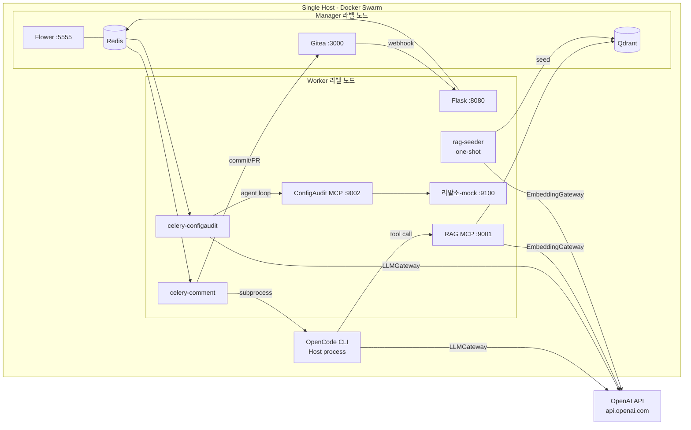
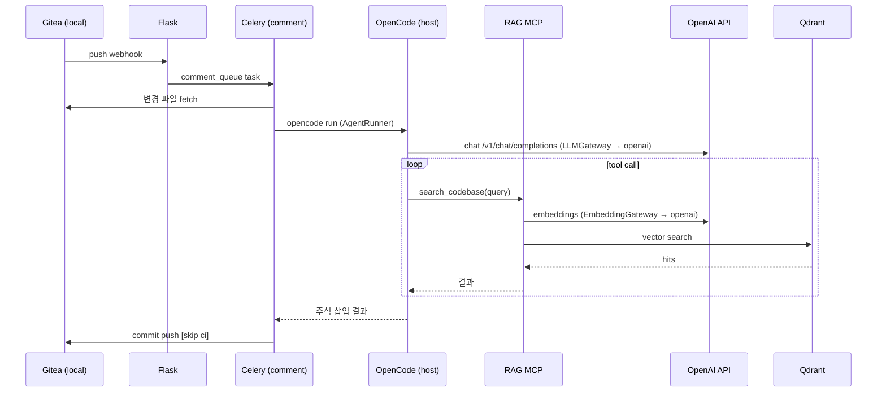
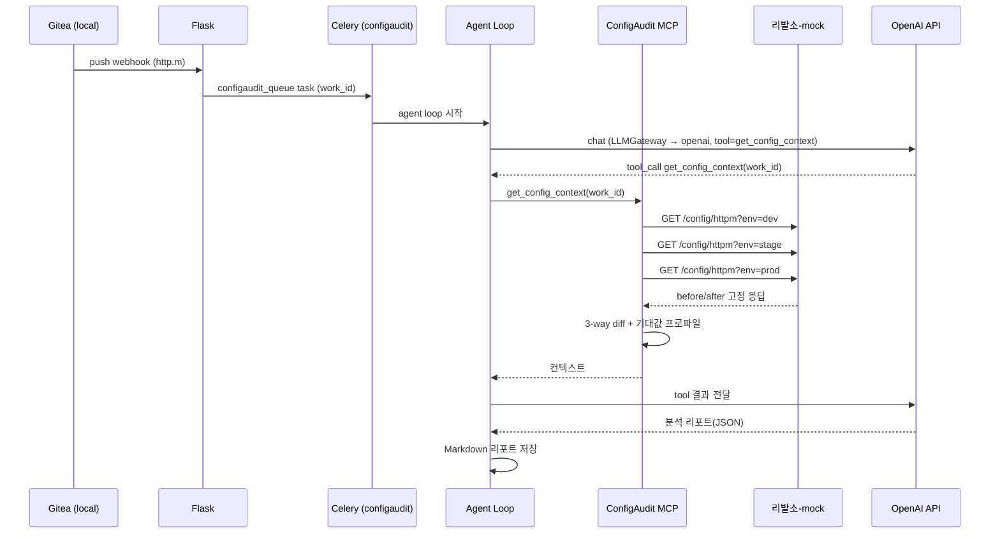

# 워크플로우 자동화 — 테스트 환경 아키텍처

> Production 아키텍처(`architecture_v2.md`) 와 동일한 흐름을 **단일 서버 + Docker Swarm(Manager+Worker 겸용)** 에서 재현하기 위한 테스트 환경 정의.

---

## 1. 요구사항 정의

### 1.1 기능 요구사항 (production 과 동일하게 동작해야 하는 것)

| # | 항목 | 설명 |
|---|---|---|
| F1 | Webhook 수신 | Gitea(or Mock Git Server) push/PR webhook 을 Flask 가 수신, HMAC 검증, work_type 판별 |
| F2 | 큐 분기 | `comment_queue`(Java 변경) / `configaudit_queue`(http.m 변경) 로 task 발행 |
| F3 | 코드 주석 워크플로우 | Celery Worker → AI Agent CLI(OpenCode 또는 대체) → LLM/RAG → 주석 삽입 commit |
| F4 | Config 변경 분석 워크플로우 | Celery Worker → Python Agent Loop → ConfigAudit MCP → LLM(분석) → 리포트 |
| F5 | RAG 검색 | RAG MCP 가 임베딩 → Qdrant 검색 → 결과 반환 (tool call 형태) |
| F6 | Config 컨텍스트 조회 | ConfigAudit MCP 가 리발소 REST API 에서 dev/stage/prod 3개 환경 config 조회 후 3-way diff 생성 |
| F7 | 모니터링 | Flower 로 Celery 작업 상태 확인 |

### 1.2 테스트 환경 고유 요구사항 (production 과 다른 점)

| # | 항목 | 결정 사항 |
|---|---|---|
| T1 | **LLM 추론** | pl99(vLLM Qwen3-Coder, GPT-OSS) 대신 **OpenAI API** 사용. 코드/manifest 는 **alias 로만 참조** (`chat-llm` / `reasoning-llm`). 모델 선정 예: `chat-llm`=gpt-4o, `reasoning-llm`=o4-mini |
| T2 | **임베딩** | **OpenAI Embedding API** 사용 (alias: `embedding`, 예: `text-embedding-3-small`). Qdrant 컬렉션 차원은 `EMBEDDING_DIM` 에 맞춰 생성 |
| T3 | **LLM 추상화 계층** | `LLMGateway` / `EmbeddingGateway` 모듈을 통해 호출. **backend (openai/vllm/azure/...) · base_url · model · api_key 를 환경변수로만 변경 가능**. alias 이름(`chat-llm` / `reasoning-llm` / `embedding`) 은 production 과 동일 — 값만 다름. pl99 자체는 구축하지 않음. 명명 규칙은 `CLAUDE.md §5` 단일 출처 |
| T4 | **인프라 토폴로지** | 단일 호스트에서 **Docker Swarm Manager + Worker 동시 수행** (single-node swarm, **Swarm 전용 — compose 모드 미사용**). 노드 라벨로 Manager/Worker 역할을 분리해 production placement 규칙을 그대로 검증 |
| T5 | **컨테이너화 범위** | OpenCode(또는 대체 AI Agent CLI) 를 **제외한 모든 모듈** 은 컨테이너로 기동. OpenCode 는 호스트에 설치하고 Celery Worker 컨테이너가 subprocess 로 호출 |
| T6 | **AI Agent CLI 추상화** | OpenCode 외 도구(Claude Code, Aider, Cursor CLI 등) 로 교체 가능하도록 `AgentRunner` 인터페이스로 분리. 실행 커맨드/인자/환경변수/결과 파싱 어댑터화 |
| T7 | **리발소 REST API** | 실제 서버 대신 **테스트용 가상 서버(Mock)** 를 컨테이너로 기동. 동일 요청에 대해 항상 동일한 (변경 전/후) config 두 벌을 return |
| T8 | **RAG 코퍼스** | 사전 준비된 **테스트 코드 + 주석(쌍)** 데이터셋을 시드. 각 snippet 에 대해 주석을 임베딩하고 코드 식별자(repo/path/symbol/lineRange) 를 메타데이터로 같이 Qdrant 에 적재 |
| T9 | **Git 원격** | 외부 Gitea 의존을 줄이기 위해 로컬 컨테이너로 **Gitea(또는 Gitea-mock)** 기동. 시드 리포 포함 |
| T10 | **시크릿 관리** | OpenAI API key 등은 Docker Swarm secret 또는 `.env` (gitignore) 로 관리. 코드/이미지에 포함 금지 |

### 1.3 비기능 요구사항

- **재현성**: `docker compose up` (또는 `docker stack deploy`) 한 번으로 전체 환경이 기동되어야 함.
- **설정 단일화**: LLM 백엔드 전환은 `config/llm.yaml` + `.env` 만 수정.
- **격리**: 테스트 데이터(Qdrant collection, Redis DB, Gitea repo) 는 production 과 물리적으로 분리.
- **리셋 용이성**: `make reset` 류 명령으로 볼륨 초기화 가능.

---

## 2. 인프라 구성

| 노드 | 역할(논리) | Swarm 라벨 | 주요 서비스 |
|---|---|---|---|
| **localhost** | Manager 겸 Worker | `role=manager`, `role=worker` 둘 다 부여 | 아래 모든 서비스 |

> 단일 호스트지만 production 의 **placement constraint** 를 그대로 사용하기 위해 노드에 두 라벨을 모두 부여한다. 향후 멀티노드로 확장할 때 manifest 변경 없이 라벨만 떼면 된다.

---

## 3. 컨테이너 / 서비스 구성

| 서비스 | 이미지(예) | 포트 | placement | 비고 |
|---|---|---|---|---|
| `flask-webhook` | 자체 빌드 | 8080 | worker | webhook 수신 |
| `celery-worker-comment` | 자체 빌드 (replicas=1~2) | - | worker | OpenCode 호출 (host bind) |
| `celery-worker-configaudit` | 자체 빌드 (replicas=1) | - | worker | Agent loop |
| `rag-mcp` | 자체 빌드 | 9001 | worker | LLMGateway/EmbeddingGateway 사용 |
| `configaudit-mcp` | 자체 빌드 | 9002 | worker | 리발소-mock 호출 |
| `leebalso-mock` | 자체 빌드 (FastAPI) | 9100 | worker | 가상 리발소 REST API |
| `redis` | `redis:7` | 6379 | manager | Celery broker/result |
| `qdrant` | `qdrant/qdrant:latest` | 6333 | manager | 벡터 DB |
| `flower` | `mher/flower` | 5555 | manager | Celery 모니터링 |
| `gitea` | `gitea/gitea:latest` | 3000 / 22 | manager | 로컬 Git 원격 (시드 repo 포함) |
| `rag-seeder` | 자체 빌드 (one-shot job) | - | worker | 부팅 시 RAG 코퍼스 적재 후 종료 |

> **OpenCode** 는 host 에 설치. `celery-worker-comment` 컨테이너에서 host 의 OpenCode 바이너리/작업 디렉터리를 bind mount + DOCKER socket 또는 sidecar 패턴으로 호출. (가장 단순한 형태는 worker 컨테이너의 `network_mode: host` + host 바이너리 직접 호출 — 결정 필요, §8 참조)

---

## 4. 네트워크 토폴로지 (테스트)



---

## 5. LLM / Embedding 추상화 계층

### 5.1 인터페이스

```python
# llm_gateway/base.py
class ChatBackend(Protocol):
    def chat(self, messages: list[dict], *, model: str, **kw) -> ChatResponse: ...
    def stream(self, messages: list[dict], *, model: str, **kw) -> Iterator[str]: ...

class EmbeddingBackend(Protocol):
    def embed(self, texts: list[str], *, model: str) -> list[list[float]]: ...
```

### 5.2 구현체

- `OpenAIChatBackend` — `base_url`, `api_key`, default `model` 을 받아 OpenAI 호환 SDK 호출
- `VLLMChatBackend` — production 용. `base_url=http://pl99:19000/qwen` 등
- `OpenAIEmbeddingBackend` / `BgeM3OnnxEmbeddingBackend`

### 5.3 설정 예 (`config/llm.yaml`) — production/test 동일

```yaml
chat:
  default: chat-llm              # 코드는 alias 만 참조
  profiles:
    chat-llm:                    # Workflow A (코드 주석/생성)
      backend: openai            # OpenAI 호환 (vLLM 도 동일 어댑터)
      base_url: ${CHAT_LLM_BASE_URL}
      api_key_env: CHAT_LLM_API_KEY
      model: ${CHAT_LLM_MODEL}
    reasoning-llm:               # Workflow B (분석/추론)
      backend: openai
      base_url: ${REASONING_LLM_BASE_URL}
      api_key_env: REASONING_LLM_API_KEY
      model: ${REASONING_LLM_MODEL}

embedding:
  default: embedding
  profiles:
    embedding:
      backend: openai
      base_url: ${EMBEDDING_BASE_URL}
      api_key_env: EMBEDDING_API_KEY
      model: ${EMBEDDING_MODEL}
      dim: ${EMBEDDING_DIM}
```

- 호출측은 항상 alias(`chat-llm` / `reasoning-llm` / `embedding`) 로 요청. backend/모델 교체는 **환경변수만** 수정.
- alias 이름은 production 과 동일 — prod ↔ test 에서 코드/yaml 한 벌 유지.
- 표준 환경변수 목록은 `CLAUDE.md §5` 와 본 문서 §12 에서 단일 출처 관리.

### 5.4 Qdrant 컬렉션 차원

- 컬렉션 생성 시 `embedding.profiles.<default>.dim` 값을 사용.
- 임베딩 모델 변경 시 컬렉션 재생성 필요(reset 스크립트 제공).

---

## 6. AI Agent CLI 추상화 (OpenCode 교체 대비)

```python
# agents/runner.py
class AgentRunner(Protocol):
    def run(self, *, work_dir: Path, prompt: str, files: list[Path],
            tools: list[ToolSpec], env: dict) -> AgentResult: ...
```

| 어댑터 | 실행 형태 | 비고 |
|---|---|---|
| `OpenCodeRunner` | `opencode run --prompt ... --tool ...` subprocess | 현재 기본 |
| `ClaudeCodeRunner` | `claude --print ...` subprocess | 후보 |
| `AiderRunner` | `aider --message ...` | 후보 |

- **Tool(MCP) 등록 방식, 결과 diff 파싱, 종료 코드** 만 어댑터별로 다름 → 인터페이스 한 곳에서 흡수.
- Celery task 는 `runner = build_runner(config.agent.kind)` 로만 받아 사용.

---

## 7. 리발소 REST API Mock

### 7.1 동작

- `GET /config/httpm?env=dev|stage|prod` — 항상 동일한 응답.
- 응답은 **변경 전(before) / 변경 후(after)** 두 벌 config 를 함께 반환.

### 7.2 응답 스키마(예)

```json
{
  "env": "dev",
  "before": "<http.m 원문 (변경 전)>",
  "after":  "<http.m 원문 (변경 후)>",
  "meta": { "fixture": "case-001", "version": "v1" }
}
```

### 7.3 픽스처

- `leebalso-mock/fixtures/case-001/{dev,stage,prod}.{before,after}.httpm` 형태로 저장.
- 쿼리 파라미터 `?case=case-001` 등으로 시나리오 전환 가능 (기본 케이스 1개부터 시작).
- 결정성 보장: 입력이 같으면 응답은 비트단위로 동일.

---

## 8. RAG MCP 테스트 코퍼스 시딩

### 8.1 데이터 형태

`rag-seeder/corpus/` 아래에 다음 3종 파일을 쌍으로 둠:

```
corpus/
  pkg/
    user_service.java                # 실제 코드
    user_service.comments.yaml       # snippet 별 주석
```

`*.comments.yaml` 예:

```yaml
- id: user_service::createUser
  path: pkg/user_service.java
  symbol: createUser
  line_range: [42, 78]
  comment: |
    신규 사용자를 생성하고 환영 메일을 큐에 적재한다.
    트랜잭션 경계: 메일 큐 적재는 outbox 패턴.
```

### 8.2 시딩 절차 (`rag-seeder` one-shot job)

1. `corpus/**/*.comments.yaml` 전체 로드.
2. 각 항목의 `comment` → `EmbeddingGateway.embed()` → 벡터.
3. Qdrant `code_comments` 컬렉션에 다음 payload 로 upsert:
   ```json
   {
     "id": "user_service::createUser",
     "path": "pkg/user_service.java",
     "symbol": "createUser",
     "line_range": [42, 78],
     "comment": "...",
     "repo": "seed-repo"
   }
   ```
4. Gitea 의 `seed-repo` 에도 동일 코드 push (워크플로우 A 검증 시 사용).

### 8.3 RAG MCP 검색 동작

- `search_codebase(query)` → `EmbeddingGateway.embed([query])` → Qdrant `code_comments` 컬렉션 검색 → top-k 의 코드 식별자(path/symbol/lineRange) + comment 반환.
- OpenCode 등 AI Agent 가 이 결과를 받아 실제 코드 파일을 열어 주석을 추가하는 흐름.

---

## 9. 워크플로우 — 테스트 환경 시퀀스

### 9.1 워크플로우 A (코드 주석)



### 9.2 워크플로우 B (Config 변경 분석)



---

## 10. 디렉터리 구조(권장)

```
llm-automation/
  architecture_v2.md
  architecture_test.md            # ← 본 문서
  docker/
    docker-stack.test.yml         # swarm stack (단일 manifest, Swarm 전용)
    sample.env                    # 그라운드 룰 §6 — 키 목록·예시값
  config/
    llm.yaml                      # §5.3
    agent.yaml                    # AgentRunner 선택/옵션
  src/
    llm_gateway/                  # §5
    agents/                       # AgentRunner 어댑터
    flask_app/
    celery_app/
    rag_mcp/
    configaudit_mcp/
  services/
    leebalso-mock/                 # §7
      app/
      fixtures/case-001/...
    rag-seeder/                   # §8
      corpus/
      seed.py
  scripts/
    init-swarm.sh                 # docker swarm init + 라벨 부여
    reset.sh                      # 볼륨/컬렉션 초기화
```

---

## 11. 부팅 절차 (Swarm 전용)

```bash
# 0. .env 준비 (그라운드 룰 §6)
cp sample.env .env
$EDITOR .env                 # OPENAI_API_KEY 등 채움

# 1. swarm 초기화 + 단일 노드에 manager/worker 라벨 부여
./scripts/init-swarm.sh

# 2. 시크릿 등록 (test 전용 source secret)
docker secret create openai_api_key - < <(grep ^OPENAI_API_KEY= .env | cut -d= -f2-)

# 3. 스택 배포
set -a; . ./.env; set +a       # docker stack deploy 는 .env 자동보간 약함
docker stack deploy -c docker/docker-stack.test.yml llmauto

# 4. 시딩 (one-shot service 가 자동 실행 후 종료)
#    Gitea 초기 repo / Qdrant 컬렉션 / RAG 코퍼스

# 5. 동작 확인
curl http://localhost:8080/health
open http://localhost:5555    # Flower
open http://localhost:3000    # Gitea
```

---

## 12. Production ↔ Test 매핑

### 12.0 모델 등가성 원칙 (Model Equivalence Principle)

테스트 환경은 production 의 AI 모델 각각에 대해 **유사한 성능 특성을 가진 다른 모델로 대체** 한다.

- **목적**: GPU/내부 인프라(pl99) 없이도 production 과 **행위적·품질적으로 동등한 검증** 을 수행한다.
- **수단**: production 의 자체 호스팅 모델(vLLM Qwen3-Coder 30B, GPT-OSS 130B, bge-m3 ONNX) 을 OpenAI 의 동급 모델로 1:1 치환한다.
- **불변성**: alias 이름(`chat-llm` / `reasoning-llm` / `embedding`), 호출 인터페이스, 환경변수 키, manifest 구조는 production 과 **완전히 동일**. 차이는 *값* 으로만 흡수한다.
- **선정 기준**:
  - `chat-llm` — 코드 이해/생성 능력. production 의 *Qwen3-Coder 30B* (코드 특화 30B chat 모델) 와 비교 가능한 OpenAI 모델 (예: `gpt-4o` / `gpt-4.1`).
  - `reasoning-llm` — 분석·추론 능력. production 의 *GPT-OSS 130B* (대형 추론 지향 모델) 와 비교 가능한 OpenAI **추론 모델** (예: `o4-mini` / `o3-mini`).
  - `embedding` — 다국어/장문 임베딩 품질·차원. production 의 *bge-m3* (1024-dim 다국어) 와 등가 영역의 OpenAI 임베딩 (예: `text-embedding-3-small` 1536-dim).
- **수용 차이**:
  - 임베딩 차원이 다를 수 있다(1024 ↔ 1536) → Qdrant 컬렉션은 `EMBEDDING_DIM` 에 맞춰 생성, 모델 변경 시 컬렉션 재생성.
  - 토크나이저/응답 latency/비용 분포는 다를 수 있음 → 기능 검증에는 영향 없음.
- **재선정 정책**: 더 적합한 모델이 등장하면 `sample.env` 의 `*_MODEL` 기본값만 갱신, 코드 변경 없음.

### 12.1 인프라/도구 차이 요약

| 항목 | Production (`v2`) | Test |
|---|---|---|
| 노드 수 | 6 (pl99 + ar41~43 + ar51~52) | 1 (single-node Swarm, manager+worker 겸용) |
| 오케스트레이션 | Docker Swarm | Docker Swarm (manifest 동일) |
| `chat-llm` | vLLM Qwen3-Coder 30B @ `pl99:19000/qwen` | OpenAI (예: gpt-4o) |
| `reasoning-llm` | vLLM GPT-OSS 130B @ `pl99:19000/gpt` | OpenAI (예: o4-mini) |
| `embedding` | bge-m3 ONNX @ `pl99:19000/embed` | OpenAI text-embedding-3-small |
| 추상화 | LLMGateway (백엔드 = vllm/http) | LLMGateway (백엔드 = openai) — **alias·env 명 동일** |
| 리발소 | 실제 REST API @ ar51 | `leebalso-mock` (고정 응답) |
| Git 원격 | 사내 Gitea | 로컬 Gitea 컨테이너 |
| OpenCode | host 설치 | host 설치 (동일) |
| 그 외 | 컨테이너 | 컨테이너 (동일) |

### 12.2 표준 환경변수 매핑 (단일 출처)

> 코드/manifest 는 좌측 `변수` 만 참조한다. 값만 환경별로 다름.

| 변수 | Production 값 | Test 값 |
|---|---|---|
| `CHAT_LLM_BASE_URL` | `http://pl99:19000/qwen` | `https://api.openai.com/v1` |
| `CHAT_LLM_MODEL` | `qwen3-coder-30b` | `gpt-4o` (예) |
| `CHAT_LLM_API_KEY` | (빈 값 또는 vLLM 키) | OpenAI 키 |
| `REASONING_LLM_BASE_URL` | `http://pl99:19000/gpt` | `https://api.openai.com/v1` |
| `REASONING_LLM_MODEL` | `gpt-oss-130b` | `o4-mini` (예) |
| `REASONING_LLM_API_KEY` | (빈 값) | OpenAI 키 |
| `EMBEDDING_BASE_URL` | `http://pl99:19000/embed` | `https://api.openai.com/v1` |
| `EMBEDDING_MODEL` | `bge-m3` | `text-embedding-3-small` (예) |
| `EMBEDDING_API_KEY` | (빈 값) | OpenAI 키 |
| `EMBEDDING_DIM` | `1024` | `1536` (모델에 맞춰) |
| `OPENAI_API_KEY` | — (사용 안 함) | **test 전용 source secret**. stack.yml 의 `environment:` 또는 Swarm secret 으로 위 `*_API_KEY` 에 주입 |

---

## 13. 결정 필요 사항 (Test)

1. **OpenAI 모델 선정** — chat/code/embedding 각각 어떤 모델을 기본 alias 로 둘지.
2. **OpenCode 컨테이너화 여부** — 호스트 설치 + worker 컨테이너에서 호출 시 결합 방식
   (a) worker 를 `network_mode: host` + host 바이너리 직접 호출
   (b) worker 컨테이너에 OpenCode 설치(요구사항상 제외 대상이지만 단순)
   (c) host 에 sidecar 데몬 + worker 가 RPC 호출
   → **(a) 권장**.
3. **Gitea 시드 자동화** — 최초 부팅 시 repo/admin 토큰/webhook 자동 등록 스크립트.
4. **RAG 코퍼스 규모** — 최소 N개 snippet (워크플로우 A 회귀 테스트 커버리지 기준).
5. **리발소 픽스처 케이스 수** — 정상/이상 패턴 몇 종을 시드할지.
