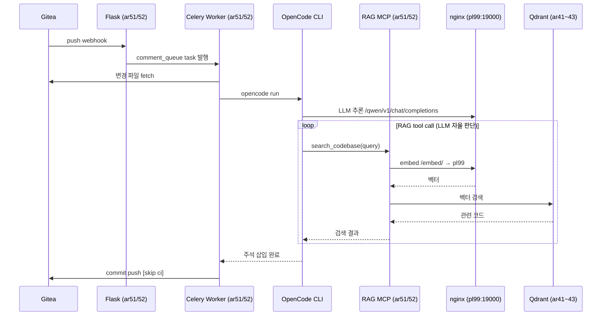
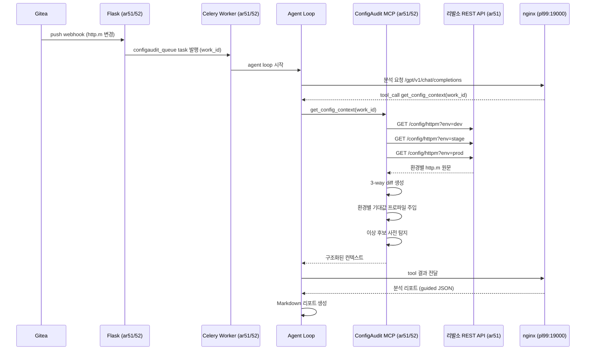
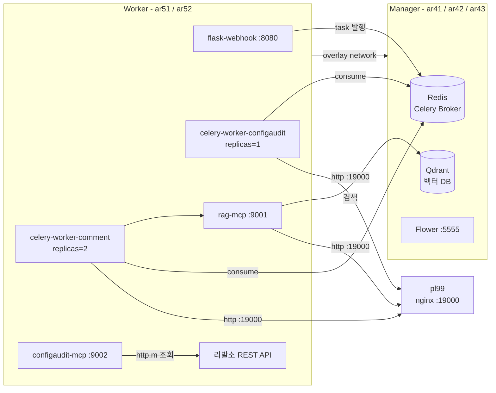
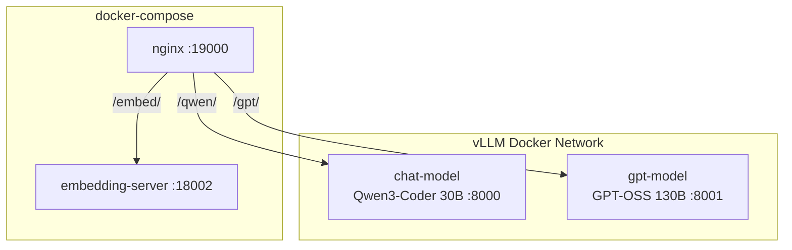

# 워크플로우 자동화 전체 아키텍처 v2

## 인프라 구성

| 장비 | 역할 | 주요 서비스 |
|---|---|---|
| **pl99** | GPU 서버 | nginx (단일 엔드포인트), vLLM (Qwen3-Coder 30B, GPT-OSS 130B), Embedding API (bge-m3 ONNX) |
| **ar41 / ar42 / ar43** | Swarm Manager | Redis, Qdrant, Flower, ConfigAudit MCP |
| **ar51 / ar52** | Swarm Worker | Flask, Celery Worker, RAG MCP |

---

## 네트워크 토폴로지

```mermaid
graph LR
    subgraph GH[Gitea (내부망)]
        WH[webhook]
    end

    subgraph SWARM[Docker Swarm Cluster]
        subgraph MGR[Manager ar41 / ar42 / ar43]
            RD[(Redis<br/>Celery Broker)]
            QD[(Qdrant<br/>벡터 DB)]
            FW[Flower UI<br/>:5555]
            WM[ConfigAudit MCP<br/>:9002]
        end
        subgraph WKR[Worker ar51 / ar52]
            FL[Flask<br/>:8080]
            CW1[Celery Worker<br/>comment_queue]
            CW2[Celery Worker<br/>configaudit_queue]
            RM[RAG MCP<br/>:9001]
        end
    end

    subgraph PL99[pl99 GPU 서버]
        EM[Embedding API<br/>bge-m3 ONNX<br/>:18002]
        Q3[vLLM<br/>Qwen3-Coder 30B<br/>:18000]
        GP[vLLM<br/>GPT-OSS 130B<br/>:18001]
    end

    GH -->|webhook| FL
    FL --> RD
    RD --> CW1
    RD --> CW2
    CW1 --> RM
    CW2 --> WM
    RM -->|embed 요청| NX2
    RM --> QD
    CW1 -->|OpenCode → vLLM| Q3
    CW2 -->|agent loop| GP
    FW --- RD
```

---

## 전체 흐름

```mermaid
flowchart TD
    GH[Gitea (내부망)]

    GH -->|push / PR| FL[Flask<br/>HMAC 검증 · work_type 판별]

    FL -->|Java 변경| CQ[(comment_queue)]
    FL -->|http.m 변경| HQ[(configaudit_queue)]

    CQ --> WA[Celery Worker<br/>코드 주석 워크플로우]
    HQ --> WB[Celery Worker<br/>Config 변경 분석 워크플로우]

    WA -->|subprocess| OC[OpenCode CLI<br/>Qwen3-Coder 30B @ pl99:18000]
    OC -->|tool call| RM[RAG MCP<br/>ar51/52 :9001]
    RM -->|embed| EM[Embedding API<br/>pl99 :18002]
    RM -->|검색| QD[(Qdrant<br/>ar41~43)]

    WB -->|agent loop| AG[Python Agent]
    AG -->|get_config_context| WM[ConfigAudit MCP<br/>ar41~43 :9002]
    AG -->|vLLM API| GP[GPT-OSS 130B<br/>pl99 :18001]

    WA -->|commit / PR| GH
    WB --> RP[리포트 저장]
```

---

## 워크플로우 A — 코드 주석 자동화



---

## 워크플로우 B — Config 변경 분석



---

## Docker Swarm 서비스 배치



### pl99 내부 구조



### 배치 기준

| 서비스 | 배치 노드 | 이유 |
|---|---|---|
| Redis | Manager (ar41~43) | 상태 데이터, HA 구성 |
| Qdrant | Manager (ar41~43) | 벡터 DB 영속성 |
| Flower | Manager | 모니터링, 관리용 |
| ConfigAudit MCP | Worker (ar51/52) | 리발소 REST API(ar51) 근접 |
| Flask | Worker (ar51/52) | webhook 부하 분산 |
| Celery Worker | Worker (ar51/52) | 작업 실행, pl99 네트워크 근접 |
| RAG MCP | Worker (ar51/52) | Celery Worker와 동일 노드 |

---

## pl99 nginx 엔드포인트

Swarm 클러스터는 pl99의 모든 AI 서비스를 **단일 포트(19000)** 로 접근.
nginx가 path 기반으로 백엔드로 라우팅.

| path prefix | backend | 용도 |
|---|---|---|
| `/qwen/` | localhost:18000 | vLLM Qwen3-Coder 30B |
| `/gpt/` | localhost:18001 | vLLM GPT-OSS 130B |
| `/embed/` | localhost:18002 | Embedding API (bge-m3) |

```nginx
# service name으로 연결 (Docker network 내부)
upstream qwen  { server chat-model:8000; }
upstream gpt   { server gpt-model:8001; }
upstream embed { server embedding-server:18002; }

server {
    listen 19000;

    location /qwen/ {
        proxy_pass http://qwen/;
        proxy_read_timeout 300s;
        proxy_set_header Host $host;
    }
    location /gpt/ {
        proxy_pass http://gpt/;
        proxy_read_timeout 300s;
        proxy_set_header Host $host;
    }
    location /embed/ {
        proxy_pass http://embed/;
        proxy_read_timeout 60s;
        proxy_set_header Host $host;
    }
}
```

docker-compose.yml (nginx + embedding-server):

```yaml
services:
  nginx:
    image: nginx:stable
    ports:
      - "19000:19000"
    volumes:
      - ./nginx.conf:/etc/nginx/nginx.conf:ro
    networks:
      - vllm-net      # vLLM 서비스와 같은 network → service name으로 접근
      - compose-net   # embedding-server와 통신
    depends_on:
      - embedding-server

  embedding-server:
    image: embedding-server:latest
    networks:
      - compose-net

networks:
  vllm-net:
    external: true    # vLLM이 이미 사용 중인 Docker network
  compose-net:
    driver: bridge
```

Swarm 클러스터에서의 호출 예시:

```
POST http://pl99:19000/qwen/v1/chat/completions   # chat-model (Qwen3-Coder 30B)
POST http://pl99:19000/gpt/v1/chat/completions    # gpt-model  (GPT-OSS 130B)
POST http://pl99:19000/embed/                     # embedding-server (bge-m3)
```

---

## Celery 큐 구성

```
comment_queue   → Celery Worker (ar51/52, replicas=2)
                  동시 작업 2개 (파일당 OpenCode 1 프로세스)

configaudit_queue     → Celery Worker (ar51/52, replicas=1)
                  분석은 순차 처리로 충분
```

동시 OpenCode 프로세스 수는 pl99 GPU 메모리와 직결.
Qwen3-Coder 30B 단독 점유 시 replicas 조정 필요.

---

## 결정 필요 사항

1. ~~pl99 Embedding API 방식~~ → **평범한 HTTP, 확정**
2. ~~http.m 파일 접근~~ → **리발소 REST API (ar51) 경유, 확정**
3. **Gitea push 방식** — 직접 commit vs PR
4. **Celery Worker replicas** — pl99 GPU 메모리 기준으로 결정
5. **Qdrant 초기 색인** — 기존 코드베이스 최초 임베딩 작업 계획

