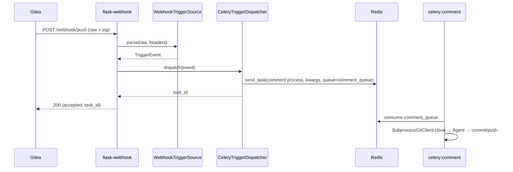
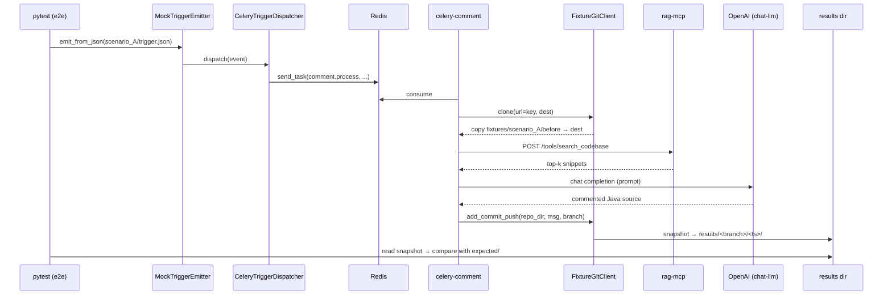
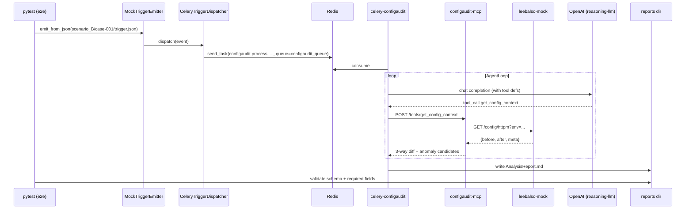

# Phase 6 — 설계서

| 항목 | 값 |
|---|---|
| Phase | 6 — E2E 통합 (트리거 추상화 + fixture 기반 시나리오) |
| 선행 문서 | `docs/P06_요구사항.md` |
| 상태 | 작성 |
| 작성일 / 최종 갱신일 | 2026-04-20 / 2026-04-20 |

---

## 1. 개요

Phase 6 은 두 축으로 설계된다.

1. **Trigger 추상화 (구조 축)** — `libs/trigger-core` 를 신설하여 "이벤트 수신 → 검증 → 도메인 모델 변환 → 작업 큐 발행" 경로를 SCM-중립 인터페이스로 분리. `services/flask-webhook` 은 HTTP 어댑터로 축소.
2. **Fixture 기반 E2E (검증 축)** — 실제 Gitea/git I/O 를 사용하지 않고 사전 준비된 파일로 시나리오 A/B 를 재현. MCP 컨테이너는 실제로 띄우고 HTTP 호출, LLM 은 OpenAI 직접 호출.

적용 원칙:
- **DIP**: 서비스(flask-webhook, celery-comment) 는 Protocol 만 의존. 구현체 교체로 테스트 분기.
- **OCP**: 새 trigger 소스(예: 파일/스케줄) 추가 시 `TriggerSource` 구현체만 추가. 기존 서비스/워커 수정 無.
- **SRP**: HTTP 어댑터 / 검증 / 도메인 모델 변환 / 큐 발행 / 업무 실행을 계층 분리.

---

## 2. 디렉터리 / 패키지 구조

### 2.1 `libs/trigger-core` (신규)

```
libs/trigger-core/
├── pyproject.toml
├── Makefile
├── README.md
├── docs/
│   ├── 요구사항.md
│   ├── 설계서.md
│   └── 테스트결과서.md
├── src/trigger_core/
│   ├── __init__.py
│   ├── models.py            # TriggerEvent, RepoRef, WorkType
│   ├── protocols.py         # TriggerSource, TriggerDispatcher
│   ├── errors.py            # InvalidSignatureError 등
│   ├── hmac_verify.py       # HMAC-SHA256 유틸 (flask-webhook 에서 이관)
│   ├── routing.py           # classify_files, WorkTypeRouter, 태스크 맵
│   ├── dedup.py             # DeliveryCache (flask-webhook 에서 이관)
│   ├── webhook.py           # WebhookTriggerSource (Gitea payload 파서 포함)
│   ├── celery_dispatch.py   # CeleryTriggerDispatcher
│   └── mock.py              # MockTriggerEmitter (테스트/로컬)
└── tests/
    ├── test_models.py
    ├── test_routing.py
    ├── test_hmac_verify.py
    ├── test_dedup.py
    ├── test_webhook.py
    ├── test_celery_dispatch.py
    └── test_mock.py
```

### 2.2 `services/flask-webhook` (리팩토링)

```
services/flask-webhook/src/flask_webhook/
├── app.py                   # Flask 팩토리 — TriggerSource/Dispatcher DI
├── settings.py              # WebhookSettings (기존 키 유지)
└── __init__.py
# 제거됨 (→ libs/trigger-core):
#   router.py, hmac_verify.py, dedup.py, models.py
```

### 2.3 `services/celery-comment` (확장)

```
services/celery-comment/src/celery_comment/
├── git_ops.py               # SubprocessGitClient (기존)
├── fixture_git_client.py    # FixtureGitClient (신규)
├── factory.py               # GIT_CLIENT 값으로 구현체 선택 (신규)
├── settings.py              # fixture_source_dir, fixture_result_dir 추가
└── ...
```

### 2.4 `e2e/` (신규)

```
e2e/
├── Makefile                 # 루트 Makefile 이 위임
├── docs/
│   ├── 요구사항.md
│   ├── 설계서.md
│   └── 테스트결과서.md
├── bin/
│   ├── emit_trigger.py      # CLI — 시나리오 payload 를 큐에 발행
│   ├── stack_up.sh          # docker stack deploy + 헬스 대기
│   └── stack_down.sh        # docker stack rm + 볼륨 정리
├── fixtures/
│   ├── scenario_A/
│   │   ├── before/          # clone 대체 소스 (Java 파일 트리)
│   │   │   └── src/main/java/...
│   │   ├── trigger.json     # TriggerEvent payload
│   │   └── expected/        # 주석 추가 후 기대 결과
│   └── scenario_B/
│       └── case-001/
│           ├── trigger.json
│           └── expected/
│               └── report.schema.json   # JSON 스키마 + 필수 필드
└── tests/
    ├── conftest.py          # stack up/down fixture, Redis/Flower 헬스
    ├── test_scenario_a.py   # Java 주석 시나리오
    └── test_scenario_b.py   # ConfigAudit 시나리오
```

### 2.5 루트 변경

- `pyproject.toml` workspace 에 `libs/trigger-core` 추가
- `infra/docker-stack.test.yml` 에 Phase 5 서비스 편입
- `sample.env` 에 Phase 6 신규 키 추가
- `Makefile` 에 `e2e` 타깃 추가

---

## 3. 인터페이스 (Protocol / 클래스 / API)

### 3.1 도메인 모델 (`trigger_core.models`)

```python
class WorkType(StrEnum):
    COMMENT = "comment"
    CONFIGAUDIT = "configaudit"


class RepoRef(BaseModel):
    """SCM-중립 저장소 참조."""
    full_name: str          # "owner/repo"
    clone_url: str          # 프로토콜 무관 식별자 (fixture 모드에서는 경로/id)
    ref: str                # "refs/heads/main"


class TriggerEvent(BaseModel):
    """이벤트 소스와 무관한 작업 트리거."""
    work_type: WorkType
    work_id: str            # "owner/repo:abc12345"
    repo_ref: RepoRef
    changed_files: list[str]
    meta: dict[str, Any] = Field(default_factory=dict)
```

### 3.2 Protocol (`trigger_core.protocols`)

```python
class TriggerSource(Protocol):
    """원시 이벤트(raw bytes + 메타) → TriggerEvent 변환 + 검증."""
    def parse(self, raw: bytes, headers: Mapping[str, str]) -> TriggerEvent: ...


class TriggerDispatcher(Protocol):
    """TriggerEvent → 작업 큐 발행. 태스크 ID 반환."""
    def dispatch(self, event: TriggerEvent) -> str: ...
```

> **Q-01 결정: 동기 시그니처 채택.** 이유: 기존 Flask(WSGI) + Celery `send_task` 이 동기 호출 패턴. 비동기는 필요 시 `AsyncTriggerDispatcher` Protocol 을 별도로 추가한다 (OCP).

### 3.3 구현체

| 클래스 | 책임 |
|---|---|
| `WebhookTriggerSource` | HMAC 검증 → Gitea payload 파싱 → `TriggerEvent`. `classify_files` 호출로 `work_type` 판정. 미매칭 시 `UnsupportedWorkTypeError` |
| `CeleryTriggerDispatcher` | `WorkType → (task_name, queue)` 맵 주입. `celery.send_task(task_name, kwargs=event.to_task_kwargs(), queue=...)` |
| `MockTriggerEmitter` | `TriggerSource` 를 **우회**. `TriggerEvent` 를 직접 받아 `Dispatcher.dispatch()` 호출. 파일(JSON)·dict·`TriggerEvent` 3가지 입력 지원 |

> **Q-02 결정: `TriggerDispatcher` 는 `libs/trigger-core` 에 포함.** 이유: 태스크명/큐 매핑 규칙 자체가 trigger 시맨틱에 속함. flask-webhook 에 두면 다른 trigger 소스가 생길 때 중복 구현이 불가피.

### 3.4 `services/flask-webhook` 내부

```python
def create_app(
    *,
    trigger_source: TriggerSource,
    dispatcher: TriggerDispatcher,
    cache: DeliveryCache,
) -> Flask:
    @app.post("/webhook/push")
    def webhook_push():
        try:
            event = trigger_source.parse(request.data, request.headers)
        except InvalidSignatureError:
            return jsonify({"error": "invalid signature"}), 401
        except UnsupportedWorkTypeError:
            return jsonify({"status": "skipped", "reason": "no matching files"}), 200

        delivery_id = request.headers.get("X-Gitea-Delivery", "")
        if delivery_id and cache.is_duplicate(delivery_id):
            return jsonify({"status": "duplicate"}), 200

        task_id = dispatcher.dispatch(event)
        if delivery_id:
            cache.mark(delivery_id)
        return jsonify({"status": "accepted", "task_id": task_id,
                        "work_type": event.work_type.value}), 200
```

Flask 계층은 **HTTP ↔ Trigger 도메인** 번역만. 비즈니스 로직 0.

### 3.5 `services/celery-comment` 의 `FixtureGitClient`

```python
class FixtureGitClient:
    """GitClient Protocol 의 fixture 구현체."""
    def __init__(self, source_root: Path, result_root: Path) -> None: ...

    def clone(self, url: str, dest: Path, ref: str) -> None:
        # url 을 fixture 키로 해석 → {source_root}/{key}/ 내용을 dest 로 복사
        ...

    def add_commit_push(self, repo_dir: Path, message: str, branch: str) -> None:
        # repo_dir 스냅샷을 {result_root}/{branch}/<timestamp>/ 로 복사
        # commit message 는 manifest.json 에 기록
        ...
```

구현체 선택:
```python
# factory.py
def build_git_client(settings: CommentSettings) -> GitClient:
    if settings.git_client == "fixture":
        return FixtureGitClient(settings.fixture_source_dir, settings.fixture_result_dir)
    return SubprocessGitClient(author=settings.commit_author)
```

---

## 4. 핵심 시퀀스 / 플로우

### 4.1 Production 경로 (Gitea webhook)



### 4.2 E2E 경로 (시나리오 A — Java 주석)



### 4.3 E2E 경로 (시나리오 B — ConfigAudit)



---

## 5. 데이터 모델 / 스키마

### 5.1 `TriggerEvent` → Celery task kwargs 매핑

| TriggerEvent 필드 | Celery kwarg | 비고 |
|---|---|---|
| `work_id` | `work_id` | 그대로 |
| `repo_ref.full_name` | `repo_url` | 기존 태스크 시그니처 유지 |
| `repo_ref.clone_url` | `clone_url` | fixture 모드에선 fixture 키 |
| `repo_ref.ref` | `ref` | |
| `changed_files` | `changed_files` | |
| `meta` | — | 로깅·추적 용도, kwargs 에는 미포함 |

기존 celery-comment / celery-configaudit 태스크 시그니처는 **그대로**. Dispatcher 만 모델→kwargs 변환 담당.

### 5.2 `e2e/fixtures/<scenario>/trigger.json` 예시

```json
{
  "work_type": "comment",
  "work_id": "demo/seed-repo:a1b2c3d4",
  "repo_ref": {
    "full_name": "demo/seed-repo",
    "clone_url": "fixture://scenario_A/before",
    "ref": "refs/heads/main"
  },
  "changed_files": ["src/main/java/com/example/Foo.java"],
  "meta": {"scenario": "A"}
}
```

`clone_url` 의 `fixture://<key>` 스킴은 `FixtureGitClient` 가 인식하는 식별자. 실 URL 이 아님.

### 5.3 시나리오 B 리포트 스키마 (`e2e/fixtures/scenario_B/<case>/expected/report.schema.json`)

JSON Schema draft-07 기반. 필수 필드:
- `work_id` (string)
- `case` (string)
- `summary` (string, minLength ≥ 1)
- `anomalies` (array)
- `details` (object)
- `generated_at` (string, ISO-8601)

LLM 자연어 내용(summary, details) 은 **존재 + 비어있지 않음** 만 검증. 구조적 재현성만 보장.

---

## 6. 설정 항목 표 (그라운드 룰 §7 — 필수)

### 6.1 Phase 6 신규 키

| 키 (env) | 모듈 | 의미 | 기본값 | 필수 | 민감 |
|---|---|---|---|---|---|
| `GIT_CLIENT` | celery-comment | `subprocess` \| `fixture` | `subprocess` | ❌ | ❌ |
| `FIXTURE_SOURCE_DIR` | celery-comment | fixture clone 소스 루트 | `/fixtures/source` | `GIT_CLIENT=fixture` 시 ✅ | ❌ |
| `FIXTURE_RESULT_DIR` | celery-comment | `add_commit_push` 스냅샷 기록 루트 | `/fixtures/results` | `GIT_CLIENT=fixture` 시 ✅ | ❌ |
| `COMMIT_AUTHOR` | celery-comment | `Name <email>` 형식 | `AI Bot <ai-bot@local>` | ❌ | ❌ |
| `E2E_STACK_NAME` | e2e harness | docker stack 이름 | `llmauto-e2e` | ❌ | ❌ |
| `E2E_FIXTURES_DIR` | e2e harness | 시나리오 루트 | `e2e/fixtures` | ❌ | ❌ |
| `E2E_BROKER_URL` | e2e harness | pytest 가 접근하는 Redis URL | `redis://localhost:6379/0` | ❌ | ❌ |
| `E2E_STACK_STARTUP_TIMEOUT` | e2e harness | 스택 헬스 대기(초) | `120` | ❌ | ❌ |
| `E2E_TASK_TIMEOUT` | e2e harness | 워커 완료 대기(초) | `180` | ❌ | ❌ |

### 6.2 기존 키 재확인 (미변경)

`WEBHOOK_HOST/PORT/SECRET`, `CELERY_BROKER_URL`, `DEDUP_TTL_SECONDS`, `CHAT_LLM_*`, `REASONING_LLM_*`, `EMBEDDING_*`, `RAG_MCP_*`, `CONFIGAUDIT_MCP_URL`, `REPORT_OUTPUT_DIR`, `OPENAI_API_KEY` — 모두 기존 모듈에서 계속 사용. `sample.env` 동기화 필수.

> 본 표의 키는 **반드시** `sample.env` 와 1:1 일치해야 합니다.

---

## 7. 의존성 / 외부 호출

- **신규 내부 의존**
  - `libs/trigger-core` ← `services/flask-webhook` (path 의존)
  - `libs/trigger-core` ← `e2e/` (MockTriggerEmitter, CeleryTriggerDispatcher 재사용)
- **외부 서비스**
  - Redis (Celery broker) — 이미 stack 에 존재
  - OpenAI API — E2E 실호출 (비용 발생)
  - 없음: Gitea (E2E 에서 미사용, C-01)
- **파이썬 의존**
  - `libs/trigger-core`: `pydantic`, `celery`, `cryptography` or `hmac`(stdlib)
  - `e2e`: `pytest`, `httpx`, `python-dotenv`

---

## 8. 테스트 전략 (TDD 케이스 목록)

### 8.1 `libs/trigger-core`

| ID | 대상 | 케이스 |
|---|---|---|
| TC-T-01 | `hmac_verify` | 올바른 서명 → True, 변조 → False, 빈 시크릿 → False |
| TC-T-02 | `classify_files` | Java only → COMMENT, http.m only → CONFIGAUDIT, 혼합 → CONFIGAUDIT 우선, 빈 목록 → None |
| TC-T-03 | `WebhookTriggerSource.parse` | 정상 payload → TriggerEvent, 서명 불일치 → `InvalidSignatureError`, 미매칭 파일 → `UnsupportedWorkTypeError` |
| TC-T-04 | `CeleryTriggerDispatcher.dispatch` | fake celery → send_task 호출 인자 검증 (task_name/queue/kwargs 매핑) |
| TC-T-05 | `MockTriggerEmitter.emit_from_json` | JSON 파일 → dispatch 호출, dict 입력, TriggerEvent 입력 3가지 |
| TC-T-06 | `DeliveryCache` | 최초 → False, 중복 → True, TTL 경과 → False |

### 8.2 `services/flask-webhook` (리팩토링)

| ID | 케이스 |
|---|---|
| FW2-T-01 | HMAC 불일치 → 401 (TriggerSource 가 raise) |
| FW2-T-02 | 정상 push + comment 파일 → 200 accepted, Dispatcher 호출 |
| FW2-T-03 | 미매칭 파일 → 200 skipped |
| FW2-T-04 | 중복 delivery → 200 duplicate (Dispatcher 미호출) |
| FW2-T-05 | `/health` → 200 |

TriggerSource/Dispatcher 는 **fake** 주입. Phase 5 의 기존 테스트 케이스와 1:1 매핑 가능하게 설계.

### 8.3 `services/celery-comment`

| ID | 케이스 |
|---|---|
| CCE-T-01 | `FixtureGitClient.clone` → 소스 트리가 dest 에 그대로 복사 |
| CCE-T-02 | `FixtureGitClient.add_commit_push` → `{result_root}/<branch>/<ts>/` 에 파일 복사 + `manifest.json` 기록 |
| CCE-T-03 | `build_git_client` — `GIT_CLIENT=fixture` → FixtureGitClient, 기본 → SubprocessGitClient |

### 8.4 `e2e/`

| ID | 케이스 |
|---|---|
| E2E-T-01 | 시나리오 A — 트리거 발행 → 워커 완료 대기 → 결과 디렉터리에 Java 파일 존재 → 주석 블록(`/**`) 카운트가 `before` 보다 증가 |
| E2E-T-02 | 시나리오 B — 트리거 발행 → 리포트 파일 생성 → JSON 스키마 유효성 통과 → 필수 필드 non-empty |
| E2E-T-03 | 스택 기동 선행 체크 — Redis/Flower/MCP 헬스 OK 후 테스트 시작 |

> **Q-04 결정: 문자열 diff 대신 구조적 검증.** 시나리오 A 는 주석 블록 개수/위치 카운트, 시나리오 B 는 JSON 스키마 + 필수 필드 non-empty. LLM 자연어 변동을 과민반응 없이 흡수.

> **Q-03 결정: pytest fixture + CLI 스크립트 둘 다 제공.** `MockTriggerEmitter` 는 pytest fixture 로 테스트에 주입되고, 동일 클래스를 CLI (`e2e/bin/emit_trigger.py`) 에서도 호출 가능. 로컬 디버깅용.

---

## 9. 운영 / 배포 고려

- **컨테이너 이미지 정책**: 각 서비스 기존 태그 유지 (`<name>:latest` for E2E stack). `libs/trigger-core` 는 wheel 로 각 서비스 이미지에 포함.
- **E2E 스택 격리**: 기본 stack 이름 `llmauto-e2e` 로 기존 `llmauto` 와 격리. 병렬 실행 가능.
- **자원**: OpenAI latency 에 따라 시나리오 1회당 20~60초 예상. NFR-07 목표치 5분 내 양 시나리오 통과.
- **teardown 보장**: `make e2e` 는 bash `trap` 으로 pytest 실패 여부와 무관하게 `stack_down.sh` 실행. 스택/볼륨/네트워크 강제 제거.

> **Q-05 결정: teardown 강제 실행.** `trap 'bash e2e/bin/stack_down.sh' EXIT` 로 pytest exit code 와 무관하게 stack rm 수행. 잔존 스택은 경고 로그 없이 깨끗이 제거해 다음 실행의 결정성 확보.

---

## 10. SOLID / 품질 검토

- **SRP**
  - HTTP 어댑터(Flask 라우트) ↔ 검증/파싱(WebhookTriggerSource) ↔ 큐 발행(CeleryTriggerDispatcher) ↔ 업무 실행(워커) 분리.
  - Git I/O (Subprocess/Fixture) 와 비즈니스 로직 분리.
- **OCP**
  - 새 trigger 소스(예: `FileWatchTriggerSource`, `ScheduledTriggerSource`) 는 `TriggerSource` 구현체만 추가. Dispatcher/워커 무변경.
  - 새 work_type 추가는 `WorkType` enum + `WorkTypeRouter` 맵만 갱신.
- **LSP**
  - `GitClient` 두 구현체(SubprocessGitClient, FixtureGitClient) 는 동일 시그니처로 교체 가능. `process_comment` 는 어느 구현이든 동일 동작.
- **ISP**
  - `TriggerSource.parse` 와 `TriggerDispatcher.dispatch` 를 분리된 Protocol 로. Source/Dispatcher 한쪽만 필요한 모듈은 해당 인터페이스만 주입.
- **DIP**
  - flask-webhook, e2e harness 는 Protocol 만 의존. 구체 구현(Gitea/Mock, Celery) 는 팩토리/DI 로 조립.

---

## 11. 미해결 / 결정 종결

| ID | 결정 |
|---|---|
| Q-01 | `TriggerSource/Dispatcher` 는 **동기** 시그니처. 비동기 필요 시 별도 Protocol 추가 |
| Q-02 | `TriggerDispatcher` 는 `libs/trigger-core` 에 포함 |
| Q-03 | `MockTriggerEmitter` 는 pytest fixture + CLI 스크립트 둘 다 제공 |
| Q-04 | E2E 비교는 구조적 검증 (시나리오 A: 주석 블록 카운트, 시나리오 B: JSON 스키마 + 필수 필드) |
| Q-05 | `make e2e` 의 teardown 은 `trap` 으로 강제 실행. 스택/볼륨 제거 |
