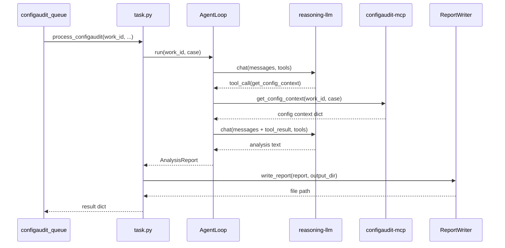

# `celery-configaudit` -- 설계서

| 항목 | 값 |
|---|---|
| 모듈 | `services/celery-configaudit` |
| 선행 문서 | `services/celery-configaudit/docs/요구사항.md` |
| 상태 | 확정 |
| 작성자 | Claude |
| 작성일 / 최종 갱신일 | 2026-04-17 / 2026-04-17 |
| 갱신 시점 | 인터페이스/설정 항목 변경 시 |

---

## 1. 개요

요구사항 FR-01~FR-06 을 SOLID 원칙으로 구현한다.

- **SRP** -- HttpConfigAuditClient(MCP HTTP) / OpenAILLMClient(LLM HTTP) / AgentLoop(오케스트레이션) / ReportWriter(파일 저장) / Task(Celery 태스크) / Settings(env) 분리.
- **OCP** -- LLM 백엔드 교체 시 LLMClient 구현체만 변경. MCP 서비스 변경 시 ConfigAuditClient 구현체만 변경.
- **DIP** -- AgentLoop 는 Protocol 인터페이스에만 의존. 구체 구현은 task.py 에서 조립.

## 2. 디렉터리 / 패키지 구조

```
services/celery-configaudit/
├── pyproject.toml
├── Dockerfile
├── Makefile
├── README.md
├── sample.env
├── docs/
│   ├── 요구사항.md
│   ├── 설계서.md           <- 본 문서
│   └── 테스트결과서.md
├── src/celery_configaudit/
│   ├── __init__.py
│   ├── settings.py          # CeleryConfigAuditSettings (pydantic-settings)
│   ├── models.py            # TaskPayload, ToolCallRequest, AnalysisReport
│   ├── protocols.py         # ConfigAuditClient, LLMClient Protocol
│   ├── mcp_client.py        # HttpConfigAuditClient (configaudit-mcp HTTP)
│   ├── llm_client.py        # OpenAILLMClient (OpenAI 호환 HTTP)
│   ├── agent_loop.py        # AgentLoop — LLM + tool call 루프
│   ├── report_writer.py     # Markdown 보고서 생성
│   ├── app.py               # Celery app 인스턴스
│   └── task.py              # configaudit.process Celery 태스크
└── tests/
    ├── __init__.py
    ├── conftest.py
    ├── test_settings.py
    ├── test_models.py
    ├── test_protocols.py
    ├── test_mcp_client.py
    ├── test_llm_client.py
    ├── test_agent_loop.py
    ├── test_report_writer.py
    ├── test_task.py
    └── test_public_api.py
```

## 3. 인터페이스 (Protocol / 클래스 / API)

### 3.1 데이터 모델 (`models.py`)

```python
from datetime import datetime
from pydantic import BaseModel

class TaskPayload(BaseModel):
    work_id: str
    repo_url: str
    ref: str
    changed_files: list[str]

class ToolCallRequest(BaseModel):
    name: str
    arguments: dict[str, Any]

class AnalysisReport(BaseModel):
    work_id: str
    case: str
    summary: str
    details: str
    anomalies: list[str]
    generated_at: datetime
```

### 3.2 Protocol (`protocols.py`)

```python
from typing import Any, Protocol

class ConfigAuditClient(Protocol):
    def get_config_context(self, work_id: str, case: str) -> dict[str, Any]: ...

class LLMClient(Protocol):
    def chat(self, messages: list[dict[str, str]],
             tools: list[dict[str, Any]]) -> dict[str, Any]: ...
```

### 3.3 HttpConfigAuditClient (`mcp_client.py`)

```python
class HttpConfigAuditClient:
    def __init__(self, base_url: str, *, timeout: float = 30.0) -> None: ...
    def get_config_context(self, work_id: str, case: str) -> dict[str, Any]: ...
```

`POST {base_url}/tools/get_config_context` 에 `{"work_id": ..., "case": ...}` 전송.

### 3.4 OpenAILLMClient (`llm_client.py`)

```python
class OpenAILLMClient:
    def __init__(self, base_url: str, model: str, api_key: str,
                 *, timeout: float = 60.0) -> None: ...
    def chat(self, messages: list[dict[str, str]],
             tools: list[dict[str, Any]]) -> dict[str, Any]: ...
```

`POST {base_url}/chat/completions` 에 OpenAI 호환 요청 전송. 응답에서 `tool_calls` 파싱.

### 3.5 AgentLoop (`agent_loop.py`)

```python
class AgentLoop:
    def __init__(self, *, llm: LLMClient, mcp: ConfigAuditClient,
                 max_iterations: int = 5) -> None: ...
    def run(self, work_id: str, case: str) -> AnalysisReport: ...
```

루프 시퀀스:
1. 시스템 프롬프트 + 사용자 메시지 구성
2. LLM 에 tool definition 포함하여 chat 호출
3. LLM 이 tool_call 반환 시 -> MCP get_config_context 호출 -> 결과를 메시지에 추가 -> 2로
4. LLM 이 텍스트 반환 시 -> AnalysisReport 파싱
5. max_iterations 초과 시 현재까지 수집된 정보로 보고서 생성

### 3.6 ReportWriter (`report_writer.py`)

```python
def write_report(report: AnalysisReport, output_dir: Path) -> Path:
    """Markdown 보고서를 파일로 저장. 반환: 생성된 파일 경로."""
```

파일명: `{work_id}_{timestamp}.md`

### 3.7 Celery App (`app.py`)

```python
celery_app = Celery("configaudit",
                    broker=settings.celery_broker_url,
                    backend=settings.celery_result_backend)
```

### 3.8 Task (`task.py`)

```python
@celery_app.task(name="configaudit.process", queue="configaudit_queue")
def process_configaudit(work_id, repo_url, clone_url, ref, changed_files) -> dict:
    """AgentLoop 실행 -> 보고서 작성 -> 결과 dict 반환."""
```

## 4. 핵심 시퀀스



## 5. 데이터 모델 / 스키마

3.1 참조. configaudit-mcp 의 `AuditContext` 스키마와 연동.

## 6. 설정 항목 표 (그라운드 룰 7 -- 필수)

| 키 (env) | 의미 | 기본값 | 필수 | 민감 | 예시 |
|---|---|---|---|---|---|
| `CELERY_BROKER_URL` | Celery 브로커 URL | `redis://localhost:6379/0` | x | x | `redis://redis:6379/0` |
| `CELERY_RESULT_BACKEND` | Celery 결과 백엔드 | `redis://localhost:6379/1` | x | x | `redis://redis:6379/1` |
| `CONFIGAUDIT_MCP_URL` | configaudit-mcp 서비스 URL | `http://localhost:9002` | x | x | `http://configaudit-mcp:9002` |
| `REASONING_LLM_BASE_URL` | reasoning-llm API base URL | `https://api.openai.com/v1` | x | x | `https://api.openai.com/v1` |
| `REASONING_LLM_MODEL` | reasoning-llm 모델명 | `o4-mini` | x | x | `o4-mini` |
| `REASONING_LLM_API_KEY` | reasoning-llm API 키 | `""` | O | O | `sk-...` |
| `REASONING_LLM_TIMEOUT_SECONDS` | LLM 호출 타임아웃(초) | `60` | x | x | `120` |
| `REPORT_OUTPUT_DIR` | 보고서 출력 디렉터리 | `/tmp/celery-configaudit/reports` | x | x | `/data/reports` |
| `AGENT_MAX_ITERATIONS` | 에이전트 루프 최대 반복 | `5` | x | x | `10` |

## 7. 의존성 / 외부 호출

- **Python 패키지**: `celery[redis]>=5.4`, `httpx>=0.27`, `pydantic>=2.7`, `pydantic-settings>=2.4`
- **외부 호출**: configaudit-mcp REST API (`POST /tools/get_config_context`), reasoning-llm OpenAI 호환 API
- **표준 라이브러리**: `datetime`, `json`, `pathlib`

## 8. 테스트 전략 (TDD 케이스)

| ID | 대상 | 케이스 | 파일 |
|---|---|---|---|
| T-01 | `TaskPayload` | 정상 생성 | `test_models.py` |
| T-02 | `ToolCallRequest` | 정상 생성 | `test_models.py` |
| T-03 | `AnalysisReport` | 전체 필드 검증 | `test_models.py` |
| T-04 | `CeleryConfigAuditSettings` | env 주입 | `test_settings.py` |
| T-05 | `CeleryConfigAuditSettings` | 기본값 로딩 | `test_settings.py` |
| T-06 | Protocol | FakeLLMClient 만족 | `test_protocols.py` |
| T-07 | Protocol | FakeConfigAuditClient 만족 | `test_protocols.py` |
| T-08 | `HttpConfigAuditClient` | 정상 호출 | `test_mcp_client.py` |
| T-09 | `HttpConfigAuditClient` | HTTP 에러 -> 예외 | `test_mcp_client.py` |
| T-10 | `OpenAILLMClient` | tool_call 응답 파싱 | `test_llm_client.py` |
| T-11 | `OpenAILLMClient` | 텍스트 응답 파싱 | `test_llm_client.py` |
| T-12 | `OpenAILLMClient` | HTTP 에러 -> 예외 | `test_llm_client.py` |
| T-13 | `AgentLoop` | happy path (tool_call -> 분석) | `test_agent_loop.py` |
| T-14 | `AgentLoop` | LLM 이 바로 텍스트 반환 (tool_call 없음) | `test_agent_loop.py` |
| T-15 | `AgentLoop` | max iterations 초과 | `test_agent_loop.py` |
| T-16 | `AgentLoop` | MCP 에러 시 에러 메시지 전달 | `test_agent_loop.py` |
| T-17 | `write_report` | 파일 생성 확인 | `test_report_writer.py` |
| T-18 | `write_report` | 파일 내용 검증 | `test_report_writer.py` |
| T-19 | `process_configaudit` | happy path | `test_task.py` |
| T-20 | `process_configaudit` | 에이전트 에러 처리 | `test_task.py` |
| T-21 | public API | import 확인 | `test_public_api.py` |
| T-22 | `AnalysisReport` | generated_at 자동 | `test_models.py` |

기대 커버리지: 라인 >= 95% / 브랜치 >= 95%.

## 9. 운영 / 배포 고려

- **배포 단위:** Docker 이미지 (`celery-configaudit:latest`).
- **컨테이너 이미지:** 표준 4-stage. runtime 은 `celery -A celery_configaudit.app worker -Q configaudit_queue` 로 기동.
- **큐:** `configaudit_queue`

## 10. SOLID 검토

| 원칙 | 적용 |
|---|---|
| SRP | HttpConfigAuditClient(MCP HTTP) / OpenAILLMClient(LLM HTTP) / AgentLoop(오케스트레이션) / ReportWriter(파일) / Task(Celery) / Settings(env) |
| OCP | 새 LLM 백엔드 = LLMClient 구현체 추가만. MCP 확장 = ConfigAuditClient 구현체 변경만 |
| LSP | LLMClient, ConfigAuditClient 어떤 구현이든 AgentLoop 에서 동일하게 동작 |
| ISP | Task 는 AgentLoop.run() + write_report() 만 호출 |
| DIP | AgentLoop 는 Protocol 에만 의존. task.py 에서 구체 구현 조립 |

## 11. 미해결 / 결정 종결

| ID (요구사항) | 결정 |
|---|---|
| Q-01 최대 반복 횟수 | 기본 5회, `AGENT_MAX_ITERATIONS` 환경변수로 조정 가능 |
| Q-02 보고서 출력 경로 | `REPORT_OUTPUT_DIR` 환경변수, 기본 `/tmp/celery-configaudit/reports` |
