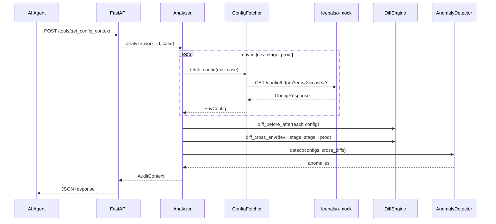

# `configaudit-mcp` — 설계서

| 항목 | 값 |
|---|---|
| 모듈 | `services/configaudit-mcp` |
| 선행 문서 | `services/configaudit-mcp/docs/요구사항.md` |
| 상태 | 확정 |
| 작성자 | Claude |
| 작성일 / 최종 갱신일 | 2026-04-16 / 2026-04-16 |
| 갱신 시점 | MCP 인터페이스/설정 항목 변경 시 |

---

## 1. 개요

요구사항 FR-01~FR-07 을 다음 SOLID 원칙으로 구현한다.

- **SRP** — ConfigFetcher(HTTP 조회) / DiffEngine(diff 생성) / AnomalyDetector(이상 탐지) / App(MCP 엔드포인트) / Settings(env) 분리.
- **OCP** — 새 환경 추가나 diff 알고리즘 변경 시 해당 모듈만 수정.
- **DIP** — App 과 Analyzer 는 `ConfigClient` Protocol 에만 의존. 테스트는 fake HTTP 주입.

## 2. 디렉터리 / 패키지 구조

```
services/configaudit-mcp/
├── pyproject.toml
├── Dockerfile
├── Makefile
├── README.md
├── sample.env
├── docs/
│   ├── 요구사항.md
│   ├── 설계서.md           ← 본 문서
│   └── 테스트결과서.md
├── src/configaudit_mcp/
│   ├── __init__.py
│   ├── models.py            # EnvConfig, DiffResult, Anomaly, AuditContext
│   ├── protocols.py         # ConfigClient Protocol
│   ├── config_fetcher.py    # HTTP 클라이언트 (leebalso API)
│   ├── diff_engine.py       # unified diff 생성
│   ├── anomaly_detector.py  # 환경 간 이상 패턴 탐지
│   ├── analyzer.py          # 오케스트레이션: fetch → diff → detect → AuditContext
│   ├── app.py               # FastAPI 앱 + MCP 엔드포인트
│   └── settings.py          # ConfigAuditSettings (pydantic-settings)
└── tests/
    ├── __init__.py
    ├── conftest.py
    ├── test_models.py
    ├── test_protocols.py
    ├── test_config_fetcher.py
    ├── test_diff_engine.py
    ├── test_anomaly_detector.py
    ├── test_analyzer.py
    ├── test_app.py
    ├── test_settings.py
    └── test_public_api.py
```

## 3. 인터페이스 (Protocol / 클래스 / API)

### 3.1 데이터 모델 (`models.py`)

```python
from pydantic import BaseModel

class EnvConfig(BaseModel):
    """한 환경의 before/after config."""
    env: str          # "dev" | "stage" | "prod"
    before: str
    after: str

class DiffResult(BaseModel):
    """diff 결과 — 환경별 또는 환경 간."""
    label: str        # e.g. "dev:before→after", "after:dev↔stage"
    diff: str         # unified diff 텍스트
    has_changes: bool

class Anomaly(BaseModel):
    """이상 패턴 한 건."""
    env: str           # 이상이 발견된 환경
    description: str   # 설명

class AuditContext(BaseModel):
    """get_config_context 최종 응답."""
    work_id: str
    case: str
    configs: list[EnvConfig]
    change_diffs: list[DiffResult]    # 각 환경의 before→after
    cross_env_diffs: list[DiffResult] # 환경 간 after 비교
    anomalies: list[Anomaly]
```

### 3.2 Protocol (`protocols.py`)

```python
from typing import Protocol
from .models import EnvConfig

class ConfigClient(Protocol):
    """리발소 API 클라이언트 인터페이스."""
    def fetch_config(self, env: str, case: str) -> EnvConfig: ...
```

### 3.3 ConfigFetcher (`config_fetcher.py`)

```python
import httpx
from .models import EnvConfig

class ConfigFetcher:
    """리발소 API HTTP 클라이언트 — ConfigClient Protocol 구현."""
    def __init__(self, base_url: str, *, timeout: float = 10.0) -> None: ...
    def fetch_config(self, env: str, case: str) -> EnvConfig: ...
```

### 3.4 DiffEngine (`diff_engine.py`)

```python
class DiffEngine:
    """unified diff 생성기."""
    def diff_before_after(self, config: EnvConfig) -> DiffResult:
        """한 환경의 before→after diff."""
    def diff_cross_env(self, left: EnvConfig, right: EnvConfig) -> DiffResult:
        """두 환경의 after 간 diff."""
```

### 3.5 AnomalyDetector (`anomaly_detector.py`)

```python
class AnomalyDetector:
    """환경 간 이상 패턴 탐지."""
    def detect(self, configs: list[EnvConfig],
               cross_diffs: list[DiffResult]) -> list[Anomaly]:
        """cross_env_diffs 에서 이상 후보 추출.
        규칙: 한 환경만 나머지 2개와 다르면 anomaly 로 보고."""
```

### 3.6 Analyzer (`analyzer.py`)

```python
class Analyzer:
    """오케스트레이션: fetch → diff → detect → AuditContext."""
    def __init__(self, *, client: ConfigClient, diff_engine: DiffEngine,
                 detector: AnomalyDetector) -> None: ...
    def analyze(self, work_id: str, case: str) -> AuditContext: ...
```

### 3.7 App (`app.py`)

```python
def create_app(*, analyzer: Analyzer | None = None,
               settings: ConfigAuditSettings | None = None) -> FastAPI:
    """팩토리 — 테스트 시 analyzer 주입 (DIP)."""
```

#### API 엔드포인트

```
POST /tools/get_config_context
```

요청:
```json
{
  "work_id": "abc-123",
  "case": "case-001"
}
```

성공 응답 (200): `AuditContext` JSON.

에러 응답:
- `422`: work_id 누락 (Pydantic 검증)
- `502`: 리발소 API 조회 실패

```
GET /health
```
응답 (200): `{ "status": "ok" }`

## 4. 핵심 시퀀스



## 5. 데이터 모델 / 스키마

§3.1 참조. 리발소 API 응답은 `leebalso-mock` 의 `ConfigResponse` 스키마를 따른다.

## 6. 설정 항목 표 (그라운드 룰 §7 — 필수)

| 키 (env) | 의미 | 기본값 | 필수 | 민감 | 예시 |
|---|---|---|---|---|---|
| `CONFIGAUDIT_HOST` | 바인드 호스트 | `0.0.0.0` | ❌ | ❌ | `0.0.0.0` |
| `CONFIGAUDIT_PORT` | 리스닝 포트 | `9002` | ❌ | ❌ | `9002` |
| `CONFIGAUDIT_DEFAULT_CASE` | 기본 case ID | `case-001` | ❌ | ❌ | `case-001` |
| `LEEBALSO_BASE_URL` | 리발소 API base URL | `http://localhost:9100` | ❌ | ❌ | `http://leebalso-mock:9100` |
| `LEEBALSO_TIMEOUT` | 리발소 API 타임아웃(초) | `10.0` | ❌ | ❌ | `30` |

## 7. 의존성 / 외부 호출

- **Python 패키지**: `fastapi>=0.115`, `uvicorn[standard]>=0.30`, `pydantic>=2.7`, `pydantic-settings>=2.4`, `httpx>=0.27`
- **외부 호출**: leebalso-mock REST API (`GET /config/httpm`)
- **표준 라이브러리**: `difflib` (diff 생성)

## 8. 테스트 전략 (TDD 케이스)

| ID | 대상 | 케이스 | 파일 |
|---|---|---|---|
| T-01 | `EnvConfig` | 정상 생성 | `test_models.py` |
| T-02 | `DiffResult` | has_changes=True/False | `test_models.py` |
| T-03 | `Anomaly` | 정상 생성 | `test_models.py` |
| T-04 | `AuditContext` | 전체 필드 검증 | `test_models.py` |
| T-05 | `ConfigFetcher` | 정상 조회 — httpx mock | `test_config_fetcher.py` |
| T-06 | `ConfigFetcher` | API 에러 → 예외 전파 | `test_config_fetcher.py` |
| T-07 | `DiffEngine.diff_before_after` | 변경 있음 → has_changes=True + diff 텍스트 | `test_diff_engine.py` |
| T-08 | `DiffEngine.diff_before_after` | 변경 없음 → has_changes=False | `test_diff_engine.py` |
| T-09 | `DiffEngine.diff_cross_env` | 환경 간 차이 있음 | `test_diff_engine.py` |
| T-10 | `DiffEngine.diff_cross_env` | 환경 간 동일 | `test_diff_engine.py` |
| T-11 | `AnomalyDetector.detect` | 3개 환경 동일 → anomalies=[] | `test_anomaly_detector.py` |
| T-12 | `AnomalyDetector.detect` | prod 만 다름 → anomaly 1건 | `test_anomaly_detector.py` |
| T-13 | `AnomalyDetector.detect` | 모든 환경 다름 → anomalies 복수 | `test_anomaly_detector.py` |
| T-14 | `Analyzer.analyze` | happy path — 3 env fetch → diffs + anomalies | `test_analyzer.py` |
| T-15 | `Analyzer.analyze` | fetch 실패 → 예외 전파 | `test_analyzer.py` |
| T-16 | `POST /tools/get_config_context` | 정상 (200) | `test_app.py` |
| T-17 | `POST /tools/get_config_context` | work_id 누락 → 422 | `test_app.py` |
| T-18 | `POST /tools/get_config_context` | case 미전달 → 기본값 사용 | `test_app.py` |
| T-19 | `GET /health` | 200 + ok | `test_app.py` |
| T-20 | `ConfigAuditSettings` | 전체 env 주입 | `test_settings.py` |
| T-21 | `ConfigAuditSettings` | 기본값 로딩 | `test_settings.py` |
| T-22 | Protocol | FakeConfigClient 만족 확인 | `test_protocols.py` |
| T-23 | public API | import 확인 | `test_public_api.py` |

기대 커버리지: 라인 ≥ 95% / 브랜치 ≥ 95%.

## 9. 운영 / 배포 고려

- **배포 단위:** Docker 이미지 (`configaudit-mcp:latest`).
- **컨테이너 이미지:** 표준 4-stage. runtime 은 uvicorn 으로 서버 기동.
- **헬스체크:** `GET /health` → `{"status": "ok"}`.
- **포트:** 9002 (architecture_test.md §3).

## 10. SOLID 검토

| 원칙 | 적용 |
|---|---|
| SRP | ConfigFetcher(HTTP) / DiffEngine(diff) / AnomalyDetector(탐지) / Analyzer(오케스트레이션) / App(HTTP) / Settings(env) |
| OCP | 새 탐지 규칙 추가 = AnomalyDetector 확장만. diff 알고리즘 교체 = DiffEngine 만 수정 |
| LSP | ConfigClient 어떤 구현이든 Analyzer 에서 동일하게 동작 |
| ISP | App 은 Analyzer.analyze() 만 호출 |
| DIP | Analyzer 는 ConfigClient Protocol 에만 의존. app.py 팩토리에서 구체 구현 조립 |

## 11. 미해결 / 결정 종결

| ID (요구사항) | 결정 |
|---|---|
| Q-01 이상 패턴 규칙 | **1환경만 나머지 2개와 다를 때 anomaly**. 간단한 규칙으로 시작, 후속 확장 가능 |
| Q-02 diff 형식 | **unified diff** (`difflib.unified_diff`). LLM 파싱에 가장 보편적 |
