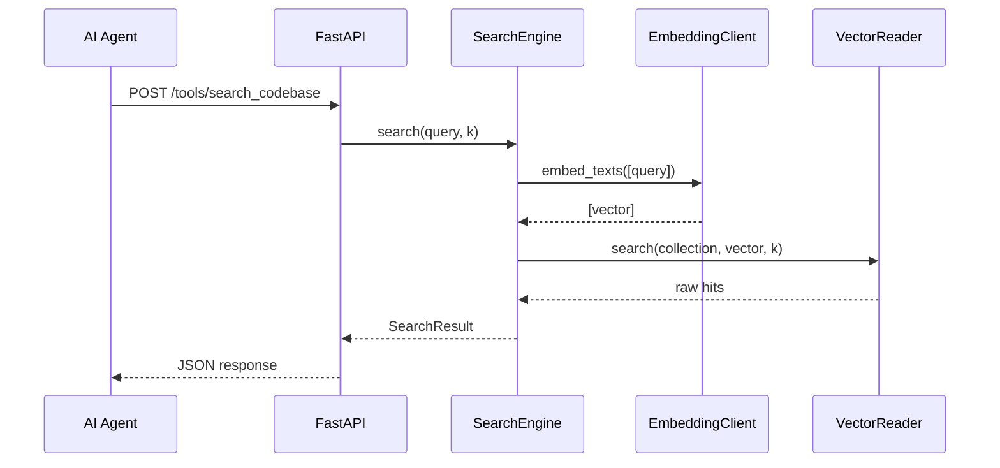

# `rag-mcp` — 설계서

| 항목 | 값 |
|---|---|
| 모듈 | `services/rag-mcp` |
| 선행 문서 | `services/rag-mcp/docs/요구사항.md` |
| 상태 | 확정 |
| 작성자 | Claude |
| 작성일 / 최종 갱신일 | 2026-04-16 / 2026-04-16 |
| 갱신 시점 | MCP 인터페이스/설정 항목 변경 시 |

---

## 1. 개요

요구사항 FR-01~FR-07 을 다음 SOLID 원칙으로 구현한다.

- **SRP** — SearchEngine(검색 코어) / QdrantReader(DB 읽기) / App(MCP 엔드포인트) / Settings(env) 분리.
- **ISP** — MCP 라우터는 SearchEngine.search() 만 호출. Qdrant/Embedding 세부 사항 불필요.
- **DIP** — SearchEngine 은 `EmbeddingClient` Protocol 과 `VectorReader` Protocol 에만 의존. 테스트는 fake 주입.

## 2. 디렉터리 / 패키지 구조

```
services/rag-mcp/
├── pyproject.toml
├── Dockerfile
├── Makefile
├── README.md
├── sample.env
├── docs/
│   ├── 요구사항.md
│   ├── 설계서.md           ← 본 문서
│   └── 테스트결과서.md
├── src/rag_mcp/
│   ├── __init__.py
│   ├── models.py            # SearchResult, SearchHit 데이터 모델
│   ├── protocols.py         # EmbeddingClient, VectorReader Protocol
│   ├── search_engine.py     # 검색 코어 로직
│   ├── qdrant_reader.py     # Qdrant 어댑터 (VectorReader 구현)
│   ├── app.py               # FastAPI 앱 + MCP 엔드포인트
│   └── settings.py          # RagMcpSettings (pydantic-settings)
└── tests/
    ├── __init__.py
    ├── conftest.py
    ├── test_models.py
    ├── test_protocols.py
    ├── test_search_engine.py
    ├── test_qdrant_reader.py
    ├── test_app.py
    ├── test_settings.py
    └── test_public_api.py
```

## 3. 인터페이스 (Protocol / 클래스 / API)

### 3.1 데이터 모델 (`models.py`)

```python
from pydantic import BaseModel

class SearchHit(BaseModel):
    """Qdrant 검색 결과 한 건."""
    id: str                   # snippet ID
    path: str                 # 파일 경로
    symbol: str               # 심볼명
    line_range: list[int]     # [start, end]
    comment: str              # 주석 텍스트
    score: float              # cosine similarity

class SearchResult(BaseModel):
    """search_codebase 응답."""
    query: str
    hits: list[SearchHit]
```

### 3.2 Protocol (`protocols.py`)

```python
from typing import Protocol

class EmbeddingClient(Protocol):
    """임베딩 벡터화 인터페이스."""
    def embed_texts(self, texts: list[str]) -> list[list[float]]: ...

class VectorReader(Protocol):
    """벡터 검색 인터페이스 — Qdrant 등."""
    def search(self, collection: str, vector: list[float], limit: int) -> list[dict[str, object]]: ...
```

### 3.3 SearchEngine (`search_engine.py`)

```python
class SearchEngine:
    def __init__(self, *, embedder: EmbeddingClient, reader: VectorReader,
                 collection: str) -> None: ...
    def search(self, query: str, k: int) -> SearchResult:
        """query 임베딩 → Qdrant 검색 → SearchResult."""
```

### 3.4 QdrantReader (`qdrant_reader.py`)

```python
class QdrantReader:
    """VectorReader Protocol 구현 — qdrant-client 사용."""
    def __init__(self, url: str, *, timeout: float = 30.0) -> None: ...
    def search(self, collection: str, vector: list[float], limit: int) -> list[dict[str, object]]: ...
```

### 3.5 App (`app.py`)

```python
from fastapi import FastAPI

def create_app(*, engine: SearchEngine | None = None) -> FastAPI:
    """팩토리 — 테스트 시 engine 주입 (DIP)."""
```

#### API 엔드포인트

```
POST /tools/search_codebase
```

요청:
```json
{
  "query": "사용자 생성 로직",
  "k": 5
}
```

성공 응답 (200):
```json
{
  "query": "사용자 생성 로직",
  "hits": [
    {
      "id": "user_service::createUser",
      "path": "pkg/user_service.java",
      "symbol": "createUser",
      "line_range": [42, 78],
      "comment": "신규 사용자를 생성하고...",
      "score": 0.87
    }
  ]
}
```

에러 응답:
- `422`: k ≤ 0 또는 query 누락 (Pydantic 검증)
- `400`: k > `MAX_K` 상한 초과

```
GET /health
```
응답 (200): `{ "status": "ok" }`

## 4. 핵심 시퀀스



## 5. 데이터 모델 / 스키마

§3.1 참조. Qdrant payload 형식은 `rag-seeder` 설계서 §5.2 와 동일.

## 6. 설정 항목 표 (그라운드 룰 §7 — 필수)

| 키 (env) | 의미 | 기본값 | 필수 | 민감 | 예시 |
|---|---|---|---|---|---|
| `RAG_MCP_HOST` | 바인드 호스트 | `0.0.0.0` | ❌ | ❌ | `0.0.0.0` |
| `RAG_MCP_PORT` | 리스닝 포트 | `9001` | ❌ | ❌ | `9001` |
| `RAG_MCP_COLLECTION_NAME` | Qdrant 컬렉션명 | `code_comments` | ❌ | ❌ | `code_comments` |
| `RAG_MCP_DEFAULT_K` | search_codebase 기본 k 값 | `5` | ❌ | ❌ | `10` |
| `RAG_MCP_MAX_K` | k 상한 | `20` | ❌ | ❌ | `50` |
| `QDRANT_URL` | Qdrant REST URL | `http://localhost:6333` | ❌ | ❌ | `http://qdrant:6333` |
| `QDRANT_TIMEOUT` | Qdrant 요청 타임아웃(초) | `30.0` | ❌ | ❌ | `60` |

> Embedding 관련 환경변수(`EMBEDDING_BASE_URL`, `EMBEDDING_MODEL`, `EMBEDDING_API_KEY`, `EMBEDDING_DIM`)는 `llm-gateway` Settings 가 직접 읽음.

## 7. 의존성 / 외부 호출

- **Python 패키지**: `fastapi>=0.115`, `uvicorn[standard]>=0.30`, `pydantic>=2.7`, `pydantic-settings>=2.4`, `qdrant-client>=1.9`
- **workspace 의존**: `llm-gateway` (path dependency — EmbeddingGateway, EmbeddingResponse)
- **외부 호출**: Embedding API (via llm-gateway), Qdrant REST/gRPC

## 8. 테스트 전략 (TDD 케이스)

| ID | 대상 | 케이스 | 파일 |
|---|---|---|---|
| T-01 | `SearchHit` | 정상 생성 + 필드 검증 | `test_models.py` |
| T-02 | `SearchResult` | 빈 hits 리스트 | `test_models.py` |
| T-03 | `SearchResult` | 다수 hits | `test_models.py` |
| T-04 | `QdrantReader.search` | 정상 검색 — 결과 반환 | `test_qdrant_reader.py` |
| T-05 | `QdrantReader.search` | 빈 결과 | `test_qdrant_reader.py` |
| T-06 | `SearchEngine.search` | happy path — embed → search → SearchResult | `test_search_engine.py` |
| T-07 | `SearchEngine.search` | 빈 결과 → hits=[] | `test_search_engine.py` |
| T-08 | `SearchEngine.search` | k=1 — 결과 1건만 | `test_search_engine.py` |
| T-09 | `SearchEngine.search` | 임베딩 실패 → 에러 전파 | `test_search_engine.py` |
| T-10 | `POST /tools/search_codebase` | 정상 (200) | `test_app.py` |
| T-11 | `POST /tools/search_codebase` | 빈 결과 (200) | `test_app.py` |
| T-12 | `POST /tools/search_codebase` | query 누락 → 422 | `test_app.py` |
| T-13 | `POST /tools/search_codebase` | k ≤ 0 → 422 | `test_app.py` |
| T-14 | `POST /tools/search_codebase` | k > MAX_K → 400 | `test_app.py` |
| T-15 | `POST /tools/search_codebase` | k 미전달 → 기본값 사용 | `test_app.py` |
| T-16 | `GET /health` | 200 + `{"status": "ok"}` | `test_app.py` |
| T-17 | `RagMcpSettings` | 모든 키 env 주입 시 정상 로딩 | `test_settings.py` |
| T-18 | `RagMcpSettings` | 기본값만으로 로딩 | `test_settings.py` |
| T-19 | Protocol | EmbeddingClient/VectorReader fake 가 Protocol 만족 확인 | `test_protocols.py` |
| T-20 | public API | `from rag_mcp import create_app, ...` import 가능 | `test_public_api.py` |

기대 커버리지: 라인 ≥ 95% / 브랜치 ≥ 95%.

## 9. 운영 / 배포 고려

- **배포 단위:** Docker 이미지 (`rag-mcp:latest`).
- **컨테이너 이미지:** 표준 4-stage. runtime 은 uvicorn 으로 서버 기동.
- **헬스체크:** `GET /health` → `{"status": "ok"}`.
- **포트:** 9001 (architecture_test.md §3).

## 10. SOLID 검토

| 원칙 | 적용 |
|---|---|
| SRP | SearchEngine(검색 로직) / QdrantReader(DB I/O) / App(HTTP) / Settings(env) 각각 단일 책임 |
| OCP | 새 벡터 DB = VectorReader 구현체만 추가 |
| LSP | VectorReader/EmbeddingClient 어떤 구현이든 SearchEngine 에서 동일하게 동작 |
| ISP | App 은 SearchEngine.search() 만 호출. DB/임베딩 세부 사항 불필요 |
| DIP | SearchEngine 은 Protocol 에만 의존. app.py 팩토리에서 구체 구현 조립 |

## 11. 미해결 / 결정 종결

| ID (요구사항) | 결정 |
|---|---|
| Q-01 k 기본값/상한 | 기본 **5**, 상한 **20** |
| Q-02 score_threshold | **미도입** — Phase 3 에서는 top-k 만. 필요 시 후속 Phase 에서 추가 |
