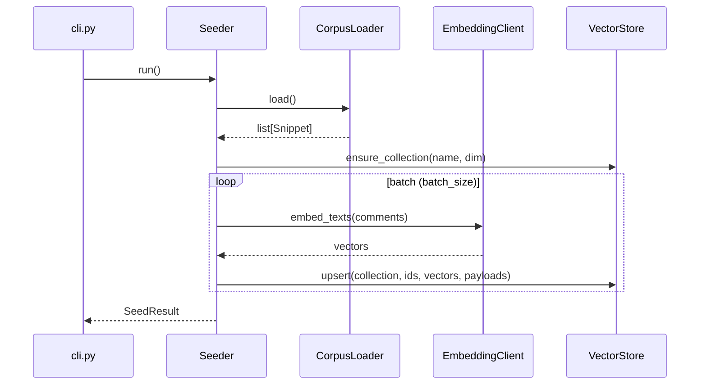

# `rag-seeder` — 설계서

| 항목 | 값 |
|---|---|
| 모듈 | `services/rag-seeder` |
| 선행 문서 | `services/rag-seeder/docs/요구사항.md` |
| 상태 | 확정 |
| 작성자 | Claude |
| 작성일 / 최종 갱신일 | 2026-04-16 / 2026-04-16 |
| 갱신 시점 | 인터페이스/설정 항목 변경 시 |

---

## 1. 개요

요구사항 FR-01~FR-07 을 다음 SOLID 원칙으로 구현한다.

- **SRP** — CorpusLoader(YAML 파싱) / Embedder(벡터화 위임) / QdrantWriter(DB 쓰기) / Seeder(오케스트레이션) / Settings(env) 분리.
- **OCP** — 새 corpus 형식이나 벡터 DB 백엔드 추가 시 Protocol 구현체만 등록.
- **DIP** — Seeder 는 `EmbeddingClient` Protocol 과 `VectorStore` Protocol 에만 의존. 테스트는 fake 주입.

## 2. 디렉터리 / 패키지 구조

```
services/rag-seeder/
├── pyproject.toml
├── Dockerfile
├── Makefile
├── README.md
├── sample.env
├── docs/
│   ├── 요구사항.md
│   ├── 설계서.md           ← 본 문서
│   └── 테스트결과서.md
├── corpus/                  # 테스트 코퍼스 (mwagent Java 코드 주석 쌍)
│   └── mwagent/
│       └── *.comments.yaml
├── src/rag_seeder/
│   ├── __init__.py
│   ├── models.py            # Snippet, SeedResult 데이터 모델
│   ├── protocols.py         # EmbeddingClient, VectorStore Protocol
│   ├── corpus_loader.py     # YAML 로드
│   ├── qdrant_store.py      # Qdrant 어댑터 (VectorStore 구현)
│   ├── seeder.py            # 오케스트레이션 (메인 로직)
│   ├── settings.py          # SeederSettings (pydantic-settings)
│   └── cli.py               # 엔트리포인트 (main)
└── tests/
    ├── __init__.py
    ├── conftest.py
    ├── test_models.py
    ├── test_corpus_loader.py
    ├── test_protocols.py
    ├── test_qdrant_store.py
    ├── test_seeder.py
    ├── test_settings.py
    ├── test_cli.py
    └── test_public_api.py
```

## 3. 인터페이스 (Protocol / 클래스)

### 3.1 데이터 모델 (`models.py`)

```python
from pydantic import BaseModel, Field

class Snippet(BaseModel):
    """코퍼스 snippet 한 건 — YAML 에서 로드."""
    id: str                          # e.g. "user_service::createUser"
    path: str                        # e.g. "pkg/user_service.java"
    symbol: str                      # e.g. "createUser"
    line_range: list[int]            # e.g. [42, 78]
    comment: str                     # 주석 텍스트
    repo: str = Field(default="seed-repo")

class SeedResult(BaseModel):
    """시딩 실행 결과 요약."""
    total_loaded: int
    total_embedded: int
    total_upserted: int
    errors: int
    duration_seconds: float
```

### 3.2 Protocol (`protocols.py`)

```python
from typing import Protocol

class EmbeddingClient(Protocol):
    """임베딩 벡터화 인터페이스 — LLMGateway.embed() 를 감싼다."""
    def embed_texts(self, texts: list[str]) -> list[list[float]]: ...

class VectorStore(Protocol):
    """벡터 저장소 인터페이스 — Qdrant 등."""
    def ensure_collection(self, name: str, dim: int) -> None: ...
    def upsert(self, collection: str, ids: list[str],
               vectors: list[list[float]], payloads: list[dict[str, object]]) -> int: ...
```

### 3.3 CorpusLoader (`corpus_loader.py`)

```python
from pathlib import Path
from .models import Snippet

class CorpusLoader:
    def __init__(self, corpus_dir: Path) -> None: ...
    def load(self) -> list[Snippet]:
        """corpus_dir/**/*.comments.yaml 재귀 로드 → Snippet 리스트."""
```

### 3.4 QdrantStore (`qdrant_store.py`)

```python
class QdrantStore:
    """VectorStore Protocol 구현 — qdrant-client 사용."""
    def __init__(self, url: str, *, timeout: float = 30.0) -> None: ...
    def ensure_collection(self, name: str, dim: int) -> None: ...
    def upsert(self, collection: str, ids: list[str],
               vectors: list[list[float]], payloads: list[dict[str, object]]) -> int: ...
```

- `ensure_collection`: 컬렉션 없으면 cosine distance 로 생성 (Q-02 결정).
- `upsert`: deterministic ID (snippet.id 의 SHA-256 hex → UUID5) 로 멱등 보장 (FR-05).

### 3.5 Seeder (`seeder.py`)

```python
class Seeder:
    def __init__(self, *, loader: CorpusLoader, embedder: EmbeddingClient,
                 store: VectorStore, settings: SeederSettings) -> None: ...
    def run(self) -> SeedResult:
        """1) load → 2) batch embed → 3) batch upsert → SeedResult."""
```

### 3.6 CLI (`cli.py`)

```python
def main() -> None:
    """엔트리포인트. Settings 로드 → 의존성 조립 → Seeder.run() → 결과 로그."""
```

## 4. 핵심 시퀀스



## 5. 데이터 모델 / 스키마

### 5.1 YAML 코퍼스 형식 (`*.comments.yaml`)

```yaml
- id: user_service::createUser
  path: pkg/user_service.java
  symbol: createUser
  line_range: [42, 78]
  comment: |
    신규 사용자를 생성하고 환영 메일을 큐에 적재한다.
```

### 5.2 Qdrant payload

```json
{
  "snippet_id": "user_service::createUser",
  "path": "pkg/user_service.java",
  "symbol": "createUser",
  "line_range": [42, 78],
  "comment": "신규 사용자를 생성하고...",
  "repo": "seed-repo"
}
```

### 5.3 Deterministic point ID

snippet.id → SHA-256 → 앞 32 hex → UUID (FR-05 멱등). 같은 snippet.id 재실행 시 동일 point 를 덮어쓴다.

## 6. 설정 항목 표 (그라운드 룰 §7 — 필수)

| 키 (env) | 의미 | 기본값 | 필수 | 민감 | 예시 |
|---|---|---|---|---|---|
| `SEEDER_CORPUS_DIR` | 코퍼스 YAML 디렉터리 | `corpus` | ❌ | ❌ | `/app/corpus` |
| `SEEDER_COLLECTION_NAME` | Qdrant 컬렉션명 | `code_comments` | ❌ | ❌ | `code_comments` |
| `SEEDER_BATCH_SIZE` | 배치당 snippet 수 | `32` | ❌ | ❌ | `64` |
| `SEEDER_REPO_NAME` | payload 에 기록할 repo 이름 | `seed-repo` | ❌ | ❌ | `seed-repo` |
| `QDRANT_URL` | Qdrant gRPC/REST URL | `http://localhost:6333` | ❌ | ❌ | `http://qdrant:6333` |
| `QDRANT_TIMEOUT` | Qdrant 요청 타임아웃(초) | `30.0` | ❌ | ❌ | `60` |
| `EMBEDDING_DIM` | 벡터 차원 | — | ✅ | ❌ | `1024` |

> Embedding 관련 환경변수(`EMBEDDING_BASE_URL`, `EMBEDDING_MODEL`, `EMBEDDING_API_KEY`)는 `llm-gateway` Settings 가 직접 읽음.

## 7. 의존성 / 외부 호출

- **Python 패키지**: `pydantic>=2.7`, `pydantic-settings>=2.4`, `pyyaml>=6.0`, `qdrant-client>=1.9`
- **workspace 의존**: `llm-gateway` (path dependency — EmbeddingGateway, EmbeddingResponse)
- **외부 호출**: Embedding API (via llm-gateway), Qdrant REST/gRPC

## 8. 테스트 전략 (TDD 케이스)

| ID | 대상 | 케이스 | 파일 |
|---|---|---|---|
| T-01 | `Snippet` | 정상 생성 + 필드 검증 | `test_models.py` |
| T-02 | `Snippet` | repo 기본값 "seed-repo" | `test_models.py` |
| T-03 | `SeedResult` | 정상 생성 | `test_models.py` |
| T-04 | `CorpusLoader.load` | 단일 YAML 파일 — snippet 리스트 파싱 | `test_corpus_loader.py` |
| T-05 | `CorpusLoader.load` | 다중 YAML 파일 재귀 로드 | `test_corpus_loader.py` |
| T-06 | `CorpusLoader.load` | 빈 디렉터리 → 빈 리스트 | `test_corpus_loader.py` |
| T-07 | `CorpusLoader.load` | YAML 외 파일 무시 | `test_corpus_loader.py` |
| T-08 | `QdrantStore.ensure_collection` | 컬렉션 미존재 → 생성 호출 | `test_qdrant_store.py` |
| T-09 | `QdrantStore.ensure_collection` | 컬렉션 존재 → 생성 스킵 | `test_qdrant_store.py` |
| T-10 | `QdrantStore.upsert` | 정상 upsert — 반환 건수 검증 | `test_qdrant_store.py` |
| T-11 | `QdrantStore.upsert` | deterministic ID — 같은 id 2회 → 동일 point | `test_qdrant_store.py` |
| T-12 | `Seeder.run` | happy path — load → embed → upsert → SeedResult | `test_seeder.py` |
| T-13 | `Seeder.run` | 빈 코퍼스 → SeedResult(0,0,0,0) | `test_seeder.py` |
| T-14 | `Seeder.run` | 배치 분할 — batch_size=2, snippets=5 → 3회 embed/upsert | `test_seeder.py` |
| T-15 | `Seeder.run` | 임베딩 에러 → errors 카운트 증가, 나머지 계속 | `test_seeder.py` |
| T-16 | `SeederSettings` | 모든 키 env 주입 시 정상 로딩 | `test_settings.py` |
| T-17 | `SeederSettings` | 기본값만으로 로딩 (EMBEDDING_DIM 제외) | `test_settings.py` |
| T-18 | `cli.main` | 정상 실행 → exit code 0 | `test_cli.py` |
| T-19 | Protocol | EmbeddingClient/VectorStore fake 가 Protocol 만족 확인 | `test_protocols.py` |
| T-20 | public API | `from rag_seeder import Seeder, ...` import 가능 | `test_public_api.py` |

기대 커버리지: 라인 ≥ 95% / 브랜치 ≥ 95%.

## 9. 운영 / 배포 고려

- **배포 단위:** Docker 이미지 (`rag-seeder:latest`).
- **실행 모드:** one-shot — 컨테이너 시작 → `cli.main()` → 종료.
- **Docker Swarm:** `deploy.restart_policy.condition: on-failure` (정상 종료 시 재시작 안 함).
- **헬스체크:** 불필요 (one-shot).

## 10. SOLID 검토

| 원칙 | 적용 |
|---|---|
| SRP | CorpusLoader / EmbeddingClient / VectorStore / Seeder / Settings 각각 단일 책임 |
| OCP | 새 벡터 DB = VectorStore 구현체만 추가. 코드 무수정 |
| LSP | VectorStore/EmbeddingClient 어떤 구현이든 Seeder 에서 동일하게 동작 |
| ISP | Seeder 는 embed_texts() / upsert() / ensure_collection() 만 호출 |
| DIP | Seeder 는 Protocol 에만 의존. cli.py 에서 구체 구현 조립 |

## 11. 미해결 / 결정 종결

| ID (요구사항) | 결정 |
|---|---|
| Q-01 배치 크기 기본값 | **32** — 임베딩 API 호출당 적정 토큰 수 |
| Q-02 distance metric | **Cosine** — 임베딩 모델 기본 유사도 측정 |
