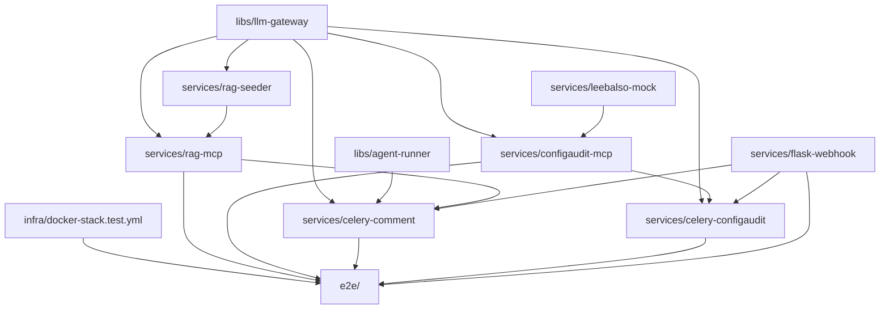

# 구현 계획 (Implementation Plan)

> 본 문서는 `architecture_test.md` 의 테스트 환경을 단계적으로 구축하기 위한 로드맵이다.
> 모든 단계는 `CLAUDE.md` 의 그라운드 룰(컨테이너 독립성 / 컨테이너별 test·release / TDD≥95% / SOLID / 문서 선행) 을 준수한다.

---

## 0. 원칙과 단계 흐름

각 Phase 의 모듈은 다음 4단계 산출물을 **반드시 순서대로** 만든다.

1. `docs/요구사항.md` (작업 착수 전)
2. `docs/설계서.md` (요구사항 확정 후)
3. 구현 (TDD: red → green → refactor, 커버리지 ≥ 95%)
4. `docs/테스트결과서.md` + Dockerfile/Makefile 검증

각 모듈은 추가로 **`설계서.md` 에 "설정 항목" 표**(환경변수/yaml 키 — 의미·기본값·필수여부·민감도) 를 두고, 동일 키를 `sample.env` 에 미러링한다 (그라운드 룰 §7).

각 모듈은 자체 `Dockerfile` (또는 라이브러리는 wheel 빌드) + 자체 `Makefile` (`test`, `coverage`, `lint`, `build`, `image`) 로 **독립 release 가능** 해야 한다.

---

## 1. 의존 그래프 (모듈 빌드 순서)

리프(공통 라이브러리) 부터 상향식으로 진행한다.

---

## 2. Phase 0 — 기반 설정 (선행 결정)

**목표:** 후속 Phase 가 시작되기 전에 도구·디렉터리·템플릿·CI 표준을 확정.

### 2.1 결정 항목 (확정)

| # | 항목 | 채택 | 비고 |
|---|---|---|---|
| D1 | 언어/런타임 | **Python 3.12** | |
| D2 | 패키지 관리/모노레포 | **uv workspace** | 모듈별 `pyproject.toml`, path 의존성 |
| D3 | 테스트 러너 | **pytest + pytest-cov + pytest-asyncio** | 커버리지 95% 게이트 |
| D4 | 린터·포매터 | **ruff** | 포맷·린트 통합 |
| D5 | 타입체크 | **mypy** | `libs/` strict |
| D6 | 컨테이너 빌드 | **multi-stage Dockerfile**, base `python:3.12-slim` | base/builder/tester/runtime 4-stage |
| D7 | 통합 테스트 | **docker compose + pytest** | E2E Phase 에서 적용 |
| D8 | CI | **옵션 B (단계적)** — Phase 0~5 는 Makefile, Phase 6 직전/협업자 합류 시 Actions yaml 추가 | yaml 은 `make <target>` 호출만 |
| D9 | 시크릿 관리 | `.env` (gitignore) + 운영 시 **Docker Swarm secret** | 그라운드 룰 §6/§7 |

### 2.1.1 CI 도입 트리거 (옵션 B 보조 룰)

다음 중 **하나라도 충족** 되면 Actions yaml 추가를 그 시점의 sub-task 로 끌어올린다.
- 협업자가 1명이라도 추가
- Phase 6 (E2E) 진입
- 첫 운영(또는 운영 유사 환경) 배포 직전

### 2.2 산출물

- `docs/templates/요구사항정의서.md` / `설계서.md` / `테스트결과서.md` 양식
- `Makefile` (루트, 각 서비스에 위임)
- `pyproject.toml` (workspace 루트)
- `.gitignore` (`.env` 차단), 루트 `sample.env` (그라운드 룰 §6)
- `CLAUDE.md` §4 에 결정 사항 확정 반영

### 2.3 완료 기준 (DoD)

- 빈 라이브러리 `libs/_template/` 1개에 위 표준이 모두 적용되어 `make test`/`make coverage`/`make image` 가 통과한다.

---

## 3. Phase 1 — 공통 추상화 라이브러리

### 3.1 `libs/llm-gateway`

- **요구사항 핵심**
  - `ChatBackend`, `EmbeddingBackend` Protocol
  - `OpenAIChatBackend`, `OpenAIEmbeddingBackend` 구현체 (vLLM 도 OpenAI 호환이라 동일 어댑터로 흡수)
  - **표준 alias**: `chat-llm` / `reasoning-llm` / `embedding` (production 과 동일, `CLAUDE.md §5` 참조)
  - alias 기반 로더: `config/llm.yaml` → `gateway.chat("chat-llm", ...)` / `gateway.chat("reasoning-llm", ...)` / `gateway.embed("embedding", ...)`
  - 재시도/타임아웃/비용 토큰 카운트 후크
- **설계 원칙**
  - DIP: 호출측은 Protocol 만 의존
  - OCP: 신규 backend 추가 시 기존 코드 수정 없이 등록
- **TDD 예**
  - alias 누락 시 `UnknownProfileError`
  - 환경변수 없는 api_key alias → `MissingCredentialsError`
  - 가짜(in-memory) backend 로 round-trip
  - 실제 OpenAI 호출은 contract test (옵션, env 있을 때만)

### 3.2 `libs/agent-runner`

- **요구사항 핵심**
  - `AgentRunner` Protocol: `run(work_dir, prompt, files, tools, env) -> AgentResult`
  - `OpenCodeRunner` 구현 (subprocess)
  - 결과 모델: 변경 파일/진단/종료 코드/로그
  - 도구(MCP) 등록 어댑터화
- **설계 원칙**
  - LSP: 어떤 Runner 든 동일 input 으로 호출 가능
  - SRP: 실행 / 결과 파싱 / 도구 등록 분리
- **TDD 예**
  - subprocess fake 로 정상/실패 케이스
  - tool spec → CLI 인자 변환
  - 결과 diff 파싱

### 3.3 산출물

- 각 라이브러리 `docs/요구사항.md`, `docs/설계서.md`, `docs/테스트결과서.md`, wheel 빌드.

---

## 4. Phase 2 — 인프라 베이스 + Mock 서비스

### 4.1 `infra/`

- `docker-stack.test.yml` (single-node Swarm 전용 manifest — compose 모드 미사용)
- `sample.env` (그라운드 룰 §6, 표준 환경변수는 `architecture_test.md §12.2` 참조)
- `scripts/init-swarm.sh` (`docker swarm init` + `role=manager` / `role=worker` 라벨 부여)
- `scripts/up.sh` (env export → secret 등록 → `docker stack deploy`)
- `scripts/reset.sh` (볼륨/컬렉션 초기화)
- 베이스 서비스: redis, qdrant, flower, gitea (이미지만, 자체 코드 없음 → 헬스체크/시드만 검증)

### 4.2 `services/leebalso-mock`

- **요구사항 핵심**
  - `GET /config/httpm?env=dev|stage|prod[&case=...]`
  - 응답: `{ env, before, after, meta }` — **결정성 보장**
  - 픽스처는 `fixtures/<case>/{dev,stage,prod}.{before,after}.httpm`
- **설계 원칙**
  - SRP: 라우팅 / 픽스처 로더 / 응답 직렬화 분리
- **TDD 예**
  - 알 수 없는 case → 404
  - 동일 요청 N회 → byte-equal 응답
  - env 누락 → 422

### 4.3 산출물

- 각 자체 `docs/`, `Dockerfile`, `Makefile`, 테스트결과서.

---

## 5. Phase 3 — RAG 계열

### 5.1 `services/rag-seeder` (one-shot 컨테이너)

- **요구사항 핵심**
  - `corpus/**/*.comments.yaml` 로드 → `EmbeddingGateway` → Qdrant upsert
  - 동시에 Gitea seed-repo 에 코드 push (옵션: 별 단계로 분리)
  - 멱등(같은 코퍼스 재실행 시 중복 없음)
- **설계 원칙**
  - DIP: Embedding/Qdrant/Git 클라이언트는 인터페이스로 주입(테스트 용이)
- **TDD 예**
  - 가짜 Embedding/Qdrant 어댑터로 upsert 호출 검증
  - 같은 코퍼스 두 번 실행 → upsert idempotency

### 5.2 `services/rag-mcp`

- **요구사항 핵심**
  - MCP 도구 `search_codebase(query, k)` 노출
  - `EmbeddingGateway` → Qdrant 검색 → top-k 식별자/주석 반환
- **설계 원칙**
  - DIP: Qdrant·Embedding 의존성 주입
  - ISP: MCP 인터페이스 / 검색 코어 분리
- **TDD 예**
  - 빈 결과/한 건/다수 결과
  - k 경계값
  - Embedding 실패 시 에러 전파

---

## 6. Phase 4 — `services/configaudit-mcp`

- **요구사항 핵심**
  - MCP 도구 `get_config_context(work_id)` 노출
  - 리발소-mock 에서 dev/stage/prod 조회 → 3-way diff → 환경별 기대값 프로파일 주입 → 이상 후보 사전 탐지
  - 결과 스키마 안정화 (LLM 이 tool 결과 파싱하므로)
- **설계 원칙**
  - SRP: HTTP 클라이언트 / diff 엔진 / 프로파일러 / 직렬화 분리
- **TDD 예**
  - 동일 3개 환경 → diff 비어 있음
  - 단일 환경만 다름 → 해당 환경에 hunk
  - 이상 패턴 픽스처 → 사전 탐지 결과 포함

---

## 7. Phase 5 — 워크플로우 진입점

### 7.1 `services/flask-webhook`

- **요구사항 핵심**
  - Gitea webhook 수신, HMAC 검증
  - work_type 판별(Java→comment_queue, http.m→configaudit_queue)
  - Celery task 발행
- **TDD 예**
  - HMAC 불일치 → 401
  - work_type 라우팅 매트릭스
  - 멱등키(중복 push 무시)

### 7.2 `services/celery-comment`

- **요구사항 핵심**
  - `comment_queue` consume → `AgentRunner` 실행 → commit/PR
  - 호스트의 OpenCode 호출 (네트워크/바이너리 결합 방식은 §13 결정 사항 반영)
- **TDD 예**
  - `AgentRunner` 가짜 구현으로 happy/실패
  - Git 작업 추상화 후 fake repo 로 commit/푸시

### 7.3 `services/celery-configaudit`

- **요구사항 핵심**
  - `configaudit_queue` consume → Agent loop → ConfigAudit MCP tool call → LLM 분석 → 리포트 저장
- **TDD 예**
  - tool_call 라운드트립 시뮬레이션
  - LLM mock 의 guided JSON 응답 파싱

---

## 8. Phase 6 — E2E 통합

- `e2e/` 디렉터리에 시나리오 테스트
  - **시나리오 A**: Java push → 주석 PR/commit 까지
  - **시나리오 B**: http.m push → 리포트 생성까지
- 도구: docker compose up + pytest (또는 testcontainers)
- 산출물: `e2e/docs/요구사항.md`, `e2e/docs/설계서.md`, `e2e/docs/테스트결과서.md`
- **DoD**
  - 두 시나리오가 단일 호스트에서 `make e2e` 한 방으로 통과

---

## 9. 모듈별 산출물 체크리스트 (공통 템플릿)

각 모듈 완료 시 아래가 모두 존재해야 한다.

- [ ] `docs/요구사항.md`
- [ ] `docs/설계서.md`
- [ ] `src/` + `tests/` (커버리지 ≥ 95%)
- [ ] `Dockerfile` (서비스) 또는 wheel build (라이브러리)
- [ ] `Makefile` (`test`, `coverage`, `lint`, `build`, `image`)
- [ ] `README.md`
- [ ] `docs/테스트결과서.md` (실행 명령/통과 수/커버리지 수치/미달 사유)

---

## 10. 진행 순서 요약 (선형 뷰)

1. **Phase 0** — 도구 결정 + 템플릿 + `_template` 라이브러리로 검증
2. **Phase 1** — `libs/llm-gateway`, `libs/agent-runner`
3. **Phase 2** — `infra/`, `services/leebalso-mock`, base infra 헬스체크
4. **Phase 3** — `services/rag-seeder`, `services/rag-mcp`
5. **Phase 4** — `services/configaudit-mcp`
6. **Phase 5** — `services/flask-webhook`, `services/celery-comment`, `services/celery-configaudit`
7. **Phase 6** — `e2e/`

각 Phase 내부에서도 모듈별 4단계(요구사항→설계→TDD→테스트결과서) 를 순서대로 밟는다.

---

## 11. 리스크 & 미해결 항목

| 리스크 | 영향 | 대응 |
|---|---|---|
| OpenCode CLI 컨테이너화 결합 방식 미정 | Phase 5 블로커 | Phase 5 착수 전 결정. 후보: (a) host network + 호스트 바이너리 직접 호출 (b) 호스트 sidecar |
| OpenAI 비용 (E2E 매번 호출) | 운영 비용/속도 | E2E 에서 LLM 호출은 캐시 또는 record/replay (예: VCR) 도입 검토 |
| 임베딩 모델 변경 시 Qdrant 컬렉션 재생성 | 시드 데이터 손실 | reset 스크립트로 명시. 컬렉션명에 모델명 suffix |
| Gitea 초기 시드(repo/admin/webhook) 자동화 | Phase 2 작업량 | 초기엔 수동 스크립트, 추후 IaC |
| 멀티 서비스 공유 라이브러리(`libs/`) 와 "컨테이너 독립성" 양립 | 설계 일관성 | uv workspace + 빌드 시 wheel 고정. 서비스 이미지에는 wheel 만 포함 |

---

## 12. 즉시 다음 액션 (착수 전 컨펌 요청)

1. Phase 0 결정 항목 D1~D9 확정 (특히 D2 uv workspace, D6 base image 정책)
2. 문서 템플릿 3종 초안 작성 (요구사항/설계/테스트결과)
3. `libs/_template/` 로 표준 검증 → 통과 시 Phase 1 진입
